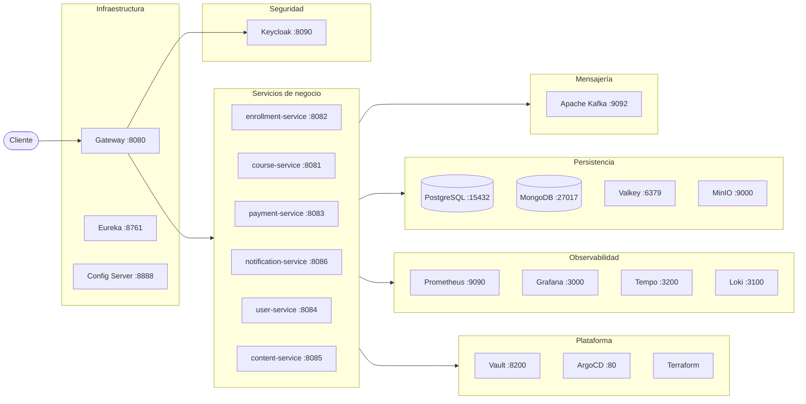
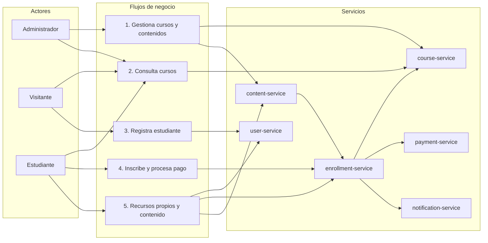

# paideia-poc-microservices-spring

Laboratorio para estudiar microservicios con Spring usando como dominio una plataforma de cursos online.

## Documentación

- [docs/index.md](docs/index.md) — índice completo: análisis, versiones, alternativas y notas de estudio


## Diagrama general del sistema


## Diagrama general del negocio

El negocio del laboratorio tiene cinco flujos principales:

1. Gestión de cursos y contenidos por parte de administradores.
2. Consulta pública de cursos.
3. Registro e inicio de sesión de estudiantes.
4. Inscripción a cursos, procesamiento de pagos y registro de notificaciones.
5. Consulta de recursos propios y contenido comprado.




## Estructura de carpetas

```
.
├── services/                    ← Microservicios de negocio (v1+)
│   ├── course-service/
│   ├── enrollment-service/
│   ├── payment-service/
│   ├── user-service/
│   ├── notification-service/
│   └── content-service/
│
├── features/                    ← Escenarios Gherkin como documentación viva
│
├── infrastructure/              ← Servicios de infraestructura (v2+)
│
├── platform/                    ← Configuración cloud e IaC (v8)
│   ├── terraform/               ← Provisión de recursos en cloud
│   ├── argocd/                  ← Manifests de sincronización GitOps
│   └── vault/                   ← Políticas y configuración de secretos
│
├── docs/                        ← Documentación del proyecto
│   ├── index.md                 ← Índice: análisis, versiones, alternativas y notas
│   ├── analisis/                ← Análisis de producto, reglas, casos de uso y flujos
│   ├── versions/                ← Detalle de cada versión (v0-v8)
│   ├── alt/                     ← Detalle de cada rama alternativa
│   └── notas/                   ← Notas temáticas (RestClient, Flyway, QA, etc.)
│
├── tools/                       ← Scripts locales, Postman y utilidades de apoyo
│
├── docker/                      ← Configuración de contenedores
│   └── postgres/                ← Init scripts para bases de datos
│
├── .env.example                 ← Plantilla de variables de entorno locales
├── docker-compose.yml           ← Orquestación local
├── pom.xml                      ← Configuración Maven multi-módulo
└── README.md                    ← Este archivo
```

## Servicios de negocio

| Servicio | Puerto | Responsabilidad | Versión inicial | Versión terminada |
|---|---|---|---|---|
| `course-service` | 8081 | Cursos, precios y estados (DRAFT/PUBLISHED/ARCHIVED) | v1 | v1 |
| `enrollment-service` | 8082 | Inscripciones y orquestación del flujo completo | v1 | v4 |
| `payment-service` | 8083 | Procesamiento de pagos simulado | v1 | v4 |
| `user-service` | 8084 | Registro de estudiantes y roles mínimos (STUDENT/ADMIN) | v1 | v5 |
| `content-service` | 8085 | Metadata flexible y archivos de cursos | v1 | v7 |
| `notification-service` | 8086 | Notificaciones al estudiante | v1 | v4 |


## Servicios de infraestructura

| Componente | Puerto | Rol | Versión inicial | Versión terminada |
|---|---|---|---|---|
| PostgreSQL | 15432 | Persistencia relacional — una BD por servicio | v1 | v8 |
| Spring Cloud Gateway | 8080 | Punto de entrada único, routing, rate limiting | v2 | v8 |
| Spring Cloud Eureka | 8761 | Service discovery — los servicios se registran por nombre | v2 | v8 |
| Spring Cloud Config | 8888 | Configuración centralizada (12-factor factor III) | v2 | v8 |
| Valkey | 6379 | Cache distribuida, base para locks y rate limiting | v2 | v8 |
| Resilience4j | — | Circuit breaker, retry con backoff, timeout, fallback | v3 | v8 |
| Apache Kafka | 9092 | Bus de eventos — desacopla pagos y notificaciones | v4 | v8 |
| Keycloak | 8090 | Identity Provider — OAuth2/OIDC, usuarios, roles y tokens | v5 | v8 |
| OpenTelemetry | — | Trazas distribuidas (instrumentación) | v6 | v8 |
| Prometheus | 9090 | Recolección de métricas | v6 | v8 |
| Grafana | 3000 | Dashboards — métricas, trazas, logs | v6 | v8 |
| Grafana Tempo | 3200 | Backend de trazas distribuidas | v6 | v8 |
| Grafana Loki | 3100 | Agregación de logs estructurados | v6 | v8 |
| Docker | — | Contenerización — multi-stage builds | v7 | v8 |
| Kubernetes | — | Orquestación de contenedores en local (`kind`/`minikube`) | v7 | v8 |
| MinIO | 9000 | Object storage para archivos y videos de cursos | v7 | v8 |
| MongoDB | 27017 | Persistencia documental — content-service | v7 | v8 |
| GitHub Actions | — | CI/CD — build, test, push de imágenes | v7 | v8 |

## Servicios de plataforma

| Componente | Puerto | Rol | Introducido en | Ambiente |
|---|---|---|---|---|
| HashiCorp Vault | 8200 | Secrets management — secretos dinámicos con rotación | v8 | Local/Cloud |
| ArgoCD | 80 | GitOps — sincroniza K8s con Git | v8 | Local/Cloud |
| Terraform | — | Infrastructure as Code — provisiona clúster y recursos | v8 | Local/Cloud |


## Stack técnico

| Componente | Versión | Rol |
|---|---|---|
| Java | 21 | Runtime |
| Spring Boot | 4.0.6 | Framework |
| Spring Framework | 7.0.7 | Core |
| Spring Cloud | 2024.0.0 | Service mesh (Gateway, Eureka, Config, LoadBalancer) |
| Hibernate | 7.x | ORM |
| Spring Data JPA | última compatible | Persistencia relacional |
| Flyway | última compatible | Migraciones de BD |
| Resilience4j | última compatible | Resiliencia (circuit breaker, retry, timeout) |
| Spring Kafka | última compatible | Integración con Kafka |
| Spring Security | última compatible | Autenticación/autorización |
| OpenTelemetry | última compatible | Instrumentación de trazas y métricas |
| Micrometer | última compatible | Recolección de métricas |
| Lombok | última compatible | Reducción de boilerplate |
| Validation | última compatible | `@Valid`, `@NotBlank`, `@Size`, etc. |
| PostgreSQL | 17 (Docker) | BD relacional |
| MongoDB | 7.x (Docker) | BD documental |
| Valkey | 8.x (Docker) | Cache distribuida y locks |
| MinIO | última compatible (Docker) | Object storage S3-compatible |
| Apache Kafka | 4.x (Docker) | Message broker |
| Prometheus | última compatible (Docker) | Recolección de métricas |
| Grafana | última compatible (Docker) | Dashboards y visualización |
| Grafana Tempo | última compatible (Docker) | Backend de trazas distribuidas |
| Grafana Loki | última compatible (Docker) | Agregación de logs |
| Keycloak | 25.x (Docker) | Identity Provider (OAuth2/OIDC) |
| Docker | última | Contenerización |
| Kubernetes | 1.29+ (`kind`/`minikube`) | Orquestación |
| Vault | última compatible (Docker) | Secrets management |
| ArgoCD | última compatible (Docker) | GitOps |
| Terraform | 1.7+ | Infrastructure as Code |
| GitHub Actions | nativa | CI/CD pipeline |


## Comandos utiles

```powershell
# Infraestructura local
docker compose up -d
docker compose down -v 

# Build y test
.\mvnw.cmd validate
.\mvnw.cmd compile
.\mvnw.cmd -pl services/course-service test

# Ejecutar servicios (en terminales separadas)
.\mvnw.cmd spring-boot:run -pl services/course-service
.\mvnw.cmd spring-boot:run -pl services/enrollment-service
.\mvnw.cmd spring-boot:run -pl services/payment-service
.\mvnw.cmd spring-boot:run -pl services/user-service
.\mvnw.cmd spring-boot:run -pl services/notification-service
.\mvnw.cmd spring-boot:run -pl services/content-service

# Scripts locales
.\scripts\local\start-services.ps1 -SkipInfra
.\scripts\local\health.ps1
.\scripts\local\stop-services.ps1
```
