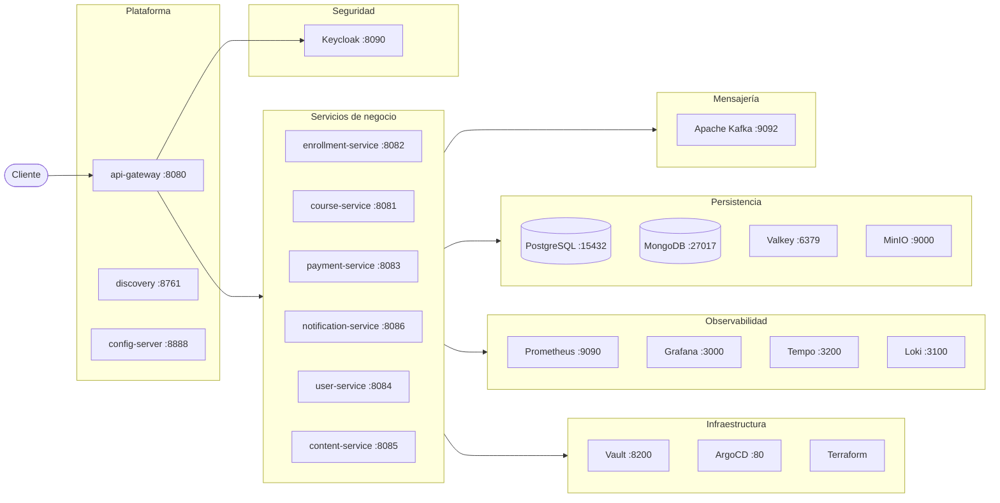
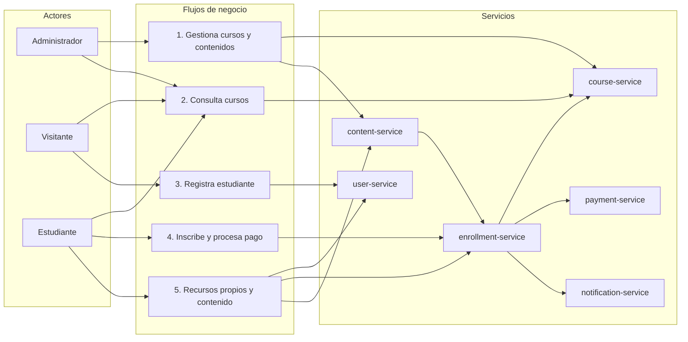

# paideia-poc-microservices-spring

Laboratorio para estudiar microservicios con Spring usando como dominio una plataforma de cursos online.

## Diagrama general del sistema

## Diagrama general del negocio

El negocio del laboratorio tiene cinco flujos principales:

1. Gestión de cursos y contenidos por parte de administradores.
2. Consulta pública de cursos.
3. Registro e inicio de sesión de estudiantes.
4. Inscripción a cursos, procesamiento de pagos y registro de notificaciones.
5. Consulta de recursos propios y contenido comprado.

## Estructura de carpetas

(desarrollar al final del laboratorio)

## Servicios de negocio

| Servicio               | Puerto | Responsabilidad                                         |
| ---------------------- | ------ | ------------------------------------------------------- |
| `course-service`       | 8081   | Cursos, precios y estados (DRAFT/PUBLISHED/ARCHIVED)    |
| `enrollment-service`   | 8082   | Inscripciones y orquestación del flujo completo         |
| `payment-service`      | 8083   | Procesamiento de pagos simulado                         |
| `user-service`         | 8084   | Registro de estudiantes y roles mínimos (STUDENT/ADMIN) |
| `content-service`      | 8085   | Metadata flexible y archivos de cursos                  |
| `notification-service` | 8086   | Notificaciones al estudiante                            |

## Infraestructura y plataforma

| Componente      | Puerto | Rol                                                                                        |
| --------------- | ------ | ------------------------------------------------------------------------------------------ |
| `postgres`      | 15432  | Persistencia relacional — una BD por servicio                                              |
| `valkey`        | 6379   | Cache distribuida, base para locks y rate limiting                                         |
| Resilience4j    | —      | Circuit breaker, retry con backoff, timeout, fallback                                      |
| `kafka`         | 9092   | Bus de eventos — desacopla pagos y notificaciones                                          |
| `keycloak`      | 8090   | Identity Provider — OAuth2/OIDC, usuarios, roles y tokens                                  |
| OpenTelemetry   | —      | Trazas distribuidas (instrumentación)                                                      |
| `prometheus`    | 9090   | Recolección de métricas                                                                    |
| `grafana`       | 3000   | Dashboards — métricas, trazas, logs                                                        |
| `tempo`         | 3200   | Backend de trazas distribuidas                                                             |
| `loki`          | 3100   | Agregación de logs estructurados                                                           |
| `docker`        | —      | Contenerización — multi-stage builds (compose + Dockerfile)                                |
| `k8s`           | —      | Orquestación de contenedores en local (`kind`/`minikube`)                                  |
| `minio`         | 9000   | Object storage para archivos y videos de cursos                                            |
| `mongo`         | 27017  | Persistencia documental — content-service                                                  |
| GitHub Actions  | —      | CI/CD — build, test, push de imágenes                                                      |
| `vault`         | 8200   | Secrets management — secretos dinámicos con rotación                                       |
| ArgoCD          | 80     | GitOps — sincroniza K8s con Git (manifests en `infrastructure/argocd`)                     |
| Terraform       | —      | Infrastructure as Code — provisiona clúster y recursos (IaC en `infrastructure/terraform`) |
| `api-gateway`   | 8080   | Punto de entrada único, routing, rate limiting                                             |
| `discovery`     | 8761   | Service discovery — los servicios se registran por nombre                                  |
| `config-server` | 8888   | Configuración centralizada (12-factor factor III)                                          |

## Stack técnico

| Componente       | Versión                    | Rol                                                  |
| ---------------- | -------------------------- | ---------------------------------------------------- |
| Java             | 21                         | Runtime                                              |
| Spring Boot      | 4.0.6                      | Framework                                            |
| Spring Framework | 7.0.7                      | Core                                                 |
| Spring Cloud     | 2024.0.0                   | Service mesh (Gateway, Eureka, Config, LoadBalancer) |
| Hibernate        | 7.x                        | ORM                                                  |
| Spring Data JPA  | última compatible          | Persistencia relacional                              |
| Flyway           | última compatible          | Migraciones de BD                                    |
| Resilience4j     | última compatible          | Resiliencia (circuit breaker, retry, timeout)        |
| Spring Kafka     | última compatible          | Integración con Kafka                                |
| Spring Security  | última compatible          | Autenticación/autorización                           |
| OpenTelemetry    | última compatible          | Instrumentación de trazas y métricas                 |
| Micrometer       | última compatible          | Recolección de métricas                              |
| Lombok           | última compatible          | Reducción de boilerplate                             |
| Validation       | última compatible          | `@Valid`, `@NotBlank`, `@Size`, etc.                 |
| PostgreSQL       | 17 (Docker)                | BD relacional                                        |
| MongoDB          | 7.x (Docker)               | BD documental                                        |
| Valkey           | 8.x (Docker)               | Cache distribuida y locks                            |
| MinIO            | última compatible (Docker) | Object storage S3-compatible                         |
| Apache Kafka     | 4.x (Docker)               | Message broker                                       |
| Prometheus       | última compatible (Docker) | Recolección de métricas                              |
| Grafana          | última compatible (Docker) | Dashboards y visualización                           |
| Grafana Tempo    | última compatible (Docker) | Backend de trazas distribuidas                       |
| Grafana Loki     | última compatible (Docker) | Agregación de logs                                   |
| Keycloak         | 25.x (Docker)              | Identity Provider (OAuth2/OIDC)                      |
| Docker           | última                     | Contenerización                                      |
| Kubernetes       | 1.29+ (`kind`/`minikube`)  | Orquestación                                         |
| Vault            | última compatible (Docker) | Secrets management                                   |
| ArgoCD           | última compatible (Docker) | GitOps                                               |
| Terraform        | 1.7+                       | Infrastructure as Code                               |
| GitHub Actions   | nativa                     | CI/CD pipeline                                       |
