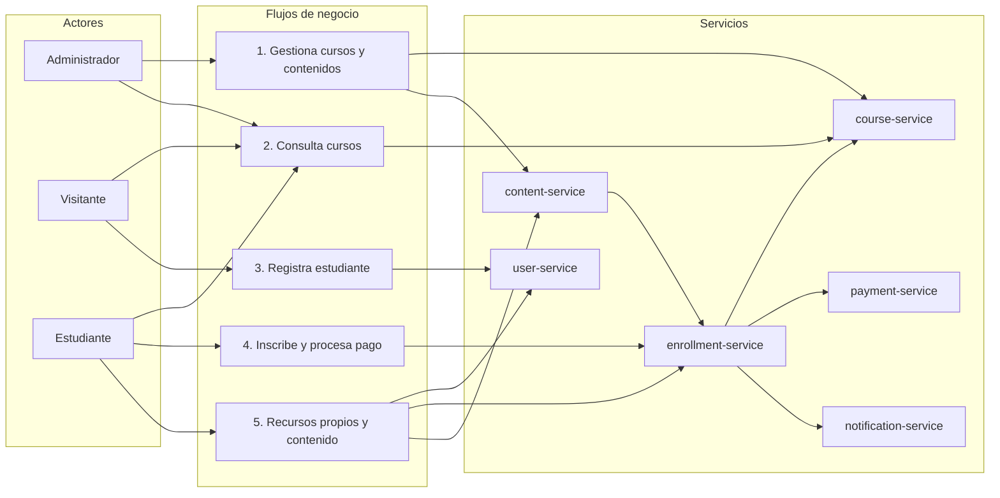

# Contexto y alcance

Este documento describe el contexto general del sistema, los flujos principales de negocio, los actores que interactúan con la plataforma y el alcance.

El laboratorio modela una plataforma de cursos online basada en microservicios. 

El objetivo es representar un dominio suficientemente realista para practicar diseño de servicios, comunicación síncrona, eventos, seguridad, persistencia y observabilidad.

## Flujos principales de negocio

El sistema contempla cinco flujos principales:

1. Gestión de cursos y contenidos por parte de administradores.
2. Consulta pública de cursos.
3. Registro e inicio de sesión de estudiantes.
4. Inscripción a cursos, procesamiento de pagos y registro de notificaciones.
5. Consulta de recursos propios y contenido comprado.

## Actores

| Actor | Descripción |
|---|---|
| Visitante | Persona no autenticada que puede consultar cursos y crear una cuenta de estudiante. |
| Estudiante | Usuario registrado que puede consultar cursos, inscribirse, realizar pagos, revisar sus recursos propios y acceder al contenido comprado. |
| Administrador | Usuario autenticado con permisos para consultar, crear, preparar y administrar cursos y contenidos. |

## Alcance

El alcance inicial se centra en representar los procesos esenciales de una plataforma de cursos online:

1. Administración de cursos y contenidos.
2. Consulta de cursos.
3. Registro de estudiantes.
4. Inscripción de estudiantes a cursos.
5. Simulación o registro de pagos aprobados y rechazados.
6. Registro de notificaciones.
7. Consulta de recursos propios y acceso a contenido comprado desde v1.

Quedan fuera del alcance inicial funcionalidades como evaluaciones, tareas, calificaciones, cupones, reembolsos, facturación, progreso por lección y envío real de notificaciones.
