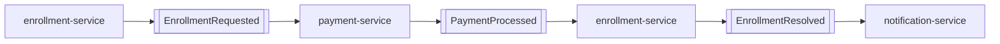

# Dominio

## Bounded contexts

| Contexto | Responsabilidad | Servicio |
|---|---|---|
| Identidad y roles | Registrar estudiantes y representar rol administrativo mínimo. | `user-service` |
| Cursos | Mantener cursos consultables para inscripción. | `course-service` |
| Inscripción | Coordinar curso, pago, estado y consulta de acceso. | `enrollment-service` |
| Pago | Simular aprobación o rechazo de cobros en local/test mediante metadata técnica. | `payment-service` |
| Notificación | Registrar mensajes derivados de inscripción. | `notification-service` |
| Contenido | Registrar metadata flexible y entregar materiales al estudiante con acceso. | `content-service` |

## Entidades principales

| Entidad | Campos clave | Contexto |
|---|---|---|
| User | `id`, `email`, `name`, `role` | Identidad y roles |
| Course | `id`, `title`, `description`, `price`, `status` | Cursos |
| Enrollment | `id`, `courseId`, `studentId`, `paymentId`, `status` | Inscripción |
| Payment | `id`, `amount`, `status`, `failureReason` | Pago |
| Notification | `id`, `recipientId`, `type`, `subject`, `body`, `status` | Notificación |
| Content | `id`, `courseId`, `filename`, `contentType`, `sizeBytes`, `storageKey`, `description`, `metadata` | Contenido |

## Estados

| Entidad | Estados | Descripción |
|---|---|---|
| `Course` | `DRAFT`, `PUBLISHED`, `ARCHIVED` | `DRAFT` está en preparación, `PUBLISHED` acepta nuevas inscripciones y `ARCHIVED` queda como curso retirado de la oferta activa. |
| `Enrollment` | `REQUESTED`, `PAYMENT_PENDING`, `ENROLLED`, `REJECTED` | Representan el ciclo de una inscripción desde su solicitud hasta su resolución final. |
| `Payment` | `APPROVED`, `REJECTED` | Representan el resultado final del procesamiento de pago. |
| `Notification` | `PENDING`, `SENT`, `FAILED` | Representan el estado de registro o envío de una notificación. |

## Eventos de dominio

| Evento | Productor | Consumidor | Uso |
|---|---|---|---|
| `EnrollmentRequested` | `enrollment-service` | `payment-service` | Iniciar pago |
| `PaymentProcessed` | `payment-service` | `enrollment-service` | Confirmar o rechazar inscripción. |
| `EnrollmentConfirmed` | `enrollment-service` | `notification-service` | Registrar notificación. |
