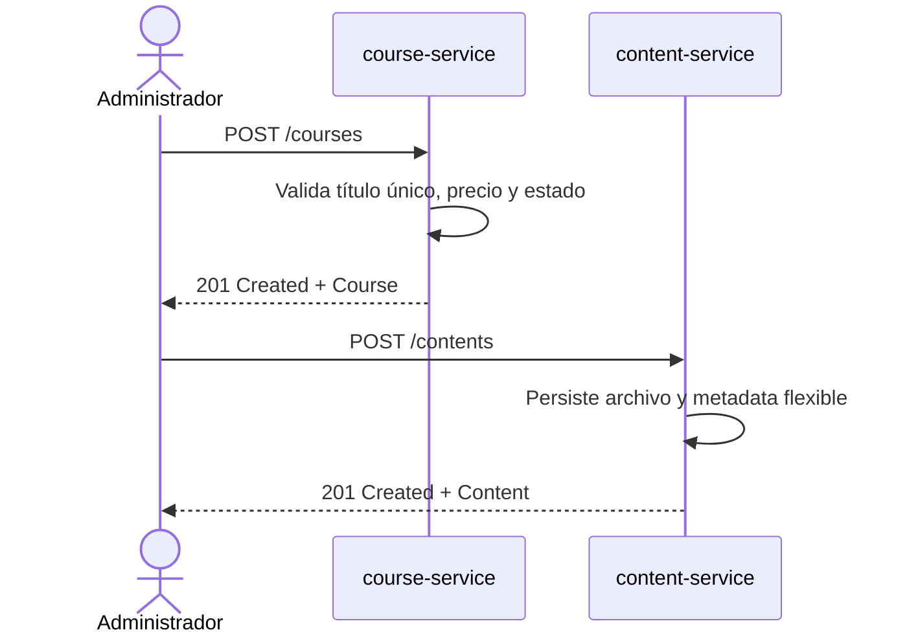
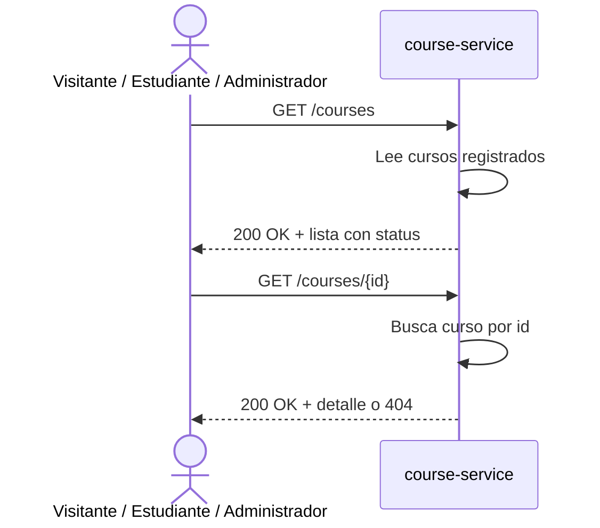
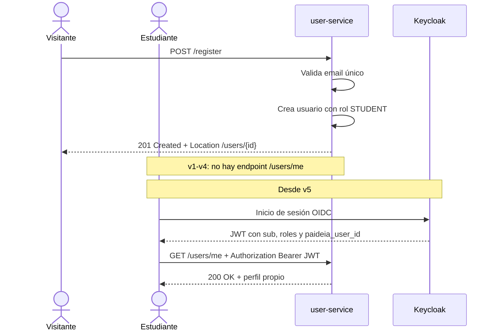
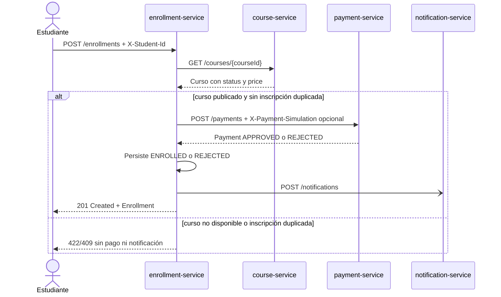
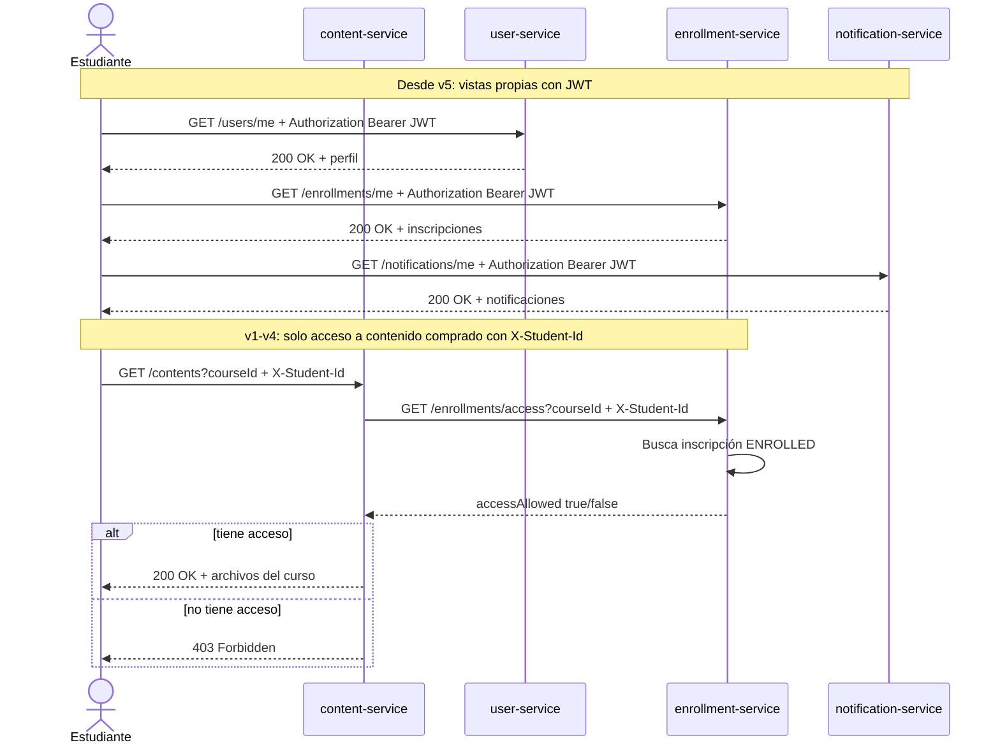

# Flujos principales

Este documento describe los cinco flujos principales.

Los contratos están escritos desde la implementación v1 y explican cómo evolucionan cuando aparecen eventos en v4 y autenticación real en v5.

## Trazabilidad

| Flujo | Casos de uso | Reglas principales |
|---|---|---|
| 1. Gestión de cursos y contenidos | `UC-001`, `UC-002` | `R-001`, `R-002`, `R-003`, `R-004`, `R-005` |
| 2. Consulta pública de cursos | `UC-003` | `R-006` |
| 3. Registro e inicio de sesión | `UC-004` | `R-007`, `R-008` |
| 4. Inscripción, pago y notificación | `UC-005`, `UC-006`, `UC-007`, `UC-008` | `R-009`, `R-010`, `R-011`, `R-012`, `R-013`, `R-014`, `R-015`, `R-016`, `R-017`, `R-018` |
| 5. Consulta de recursos propios y contenido comprado | `UC-009` desde v5, `UC-010` desde v1 | `R-019`, `R-020` |

## 1. Gestión de cursos y contenidos por parte de administradores

El administrador prepara cursos y registra materiales de contenido asociados a cada curso. En v1-v4 el laboratorio no valida una identidad real de administrador; desde v5 estos endpoints quedan protegidos con JWT y rol `ROLE_ADMIN`.

### Datos enviados

| Acción | Endpoint | Datos principales |
|---|---|---|
| Crear curso | `POST /courses` | `title`, `description`, `price`, `status` |
| Registrar contenido | `POST /contents` | `multipart/form-data`: `courseId`, `description`, `metadata`, `file` |

### Decisiones del flujo

| Regla | Resultado |
|---|---|
| No puede existir otro curso con el mismo título. | Se rechaza la creación con conflicto de negocio. |
| El precio no puede ser negativo. | Se rechaza la solicitud inválida. |
| El contenido queda asociado a un curso por `courseId`. | El material queda disponible solo si el estudiante compra el curso. |
| Desde v5 el actor debe tener `ROLE_ADMIN`. | Sin rol suficiente, la plataforma responde 401/403. |

## 2. Consulta pública de cursos

Visitantes, estudiantes y administradores pueden consultar los cursos registrados. La consulta muestra el estado de cada curso para diferenciar cursos en preparación, cursos disponibles para inscripción y cursos retirados de la oferta activa.

Un curso `PUBLISHED` está disponible para nuevas inscripciones. Un curso `DRAFT` aún está en preparación. Un curso `ARCHIVED` queda como registro histórico o material retirado, por lo que puede consultarse con su estado, pero no acepta nuevas compras.

### Datos enviados

| Acción | Endpoint | Datos principales |
|---|---|---|
| Consultar cursos | `GET /courses` | Sin body; puede llamarlo visitante, estudiante o administrador |
| Consultar detalle | `GET /courses/{id}` | `id` en la URL |

### Decisiones del flujo

| Regla | Resultado |
|---|---|
| Los cursos pueden consultarse sin rol administrativo. | La plataforma devuelve cursos registrados con su estado. |
| Un curso `DRAFT` o `ARCHIVED` puede aparecer en consulta. | El estado informa que no acepta nuevas inscripciones. |
| El curso solicitado no existe. | La plataforma responde 404. |

## 3. Registro e inicio de sesión de estudiantes

El registro público crea un usuario con rol `STUDENT` en `user-service`. El endpoint de creación es `POST /register`; en v1-v4 no se expone una vista propia del perfil. `GET /users/me` se agrega desde v5, cuando la identidad ya viene de un JWT.

En v1-v4 no hay inicio de sesión real. El estudiante toma el `id` devuelto por `user-service` y lo usa como identidad simulada mediante el header `X-Student-Id` solo en flujos que requieren propietario, como inscripción y acceso a contenido comprado.

Desde v5, Keycloak se encarga de autenticar credenciales y emitir el JWT. `user-service` conserva el identificador de negocio de Paideia y el perfil extendido del estudiante. El JWT incluye un claim personalizado `paideia_user_id` con el UUID de `user-service`; el claim estándar `sub` sigue siendo el identificador técnico generado por Keycloak.

### Datos enviados

| Acción | Endpoint | Datos principales |
|---|---|---|
| Registrar estudiante | `POST /register` | `email`, `name` |
| Consultar perfil propio desde v5 | `GET /users/me` | JWT con `paideia_user_id` |
| Consultar usuario por administración | `GET /users/{id}` | `id` en la URL; requiere permisos administrativos |
| Iniciar sesión desde v5 | Keycloak OIDC | Credenciales del usuario; la aplicación recibe un JWT |

## 4. Inscripción a cursos, procesamiento de pagos y registro de notificaciones

El estudiante solicita comprar acceso a un curso publicado. El cliente no envía precio ni moneda: solo envía el curso que quiere comprar. `enrollment-service` consulta el curso, toma el `price` vigente desde `course-service`, valida que el estado sea `PUBLISHED`, solicita el pago por ese monto y persiste la inscripción según el resultado.

Los cursos `DRAFT` y `ARCHIVED` pueden verse en la consulta de cursos, pero no aceptan nuevas inscripciones.

En v1-v4 la identidad del estudiante llega por `X-Student-Id` solo para acciones que necesitan propietario. Desde v5 se reemplaza por `Authorization: Bearer <jwt>` y el estudiante se obtiene del claim `paideia_user_id`. Las consultas propias se agregan desde v5 con endpoints `/{recurso}/me`; las consultas globales quedan para administración o comunicación interna.

La simulación de pago no forma parte del DTO de negocio. En local/test se fuerza con `X-Payment-Simulation: APPROVED` o `X-Payment-Simulation: REJECTED`. Si no se envía, el pago simulado aprueba por defecto. En v4, cuando el pago viaje por eventos, esa simulación debe moverse como metadata del evento para no contaminar el payload de negocio.

### Datos enviados por el estudiante

| Acción | Endpoint | Datos principales |
|---|---|---|
| Solicitar inscripción v1-v4 | `POST /enrollments` | Body: `courseId`; header: `X-Student-Id` |
| Forzar pago en local/test | `POST /enrollments` | Header opcional: `X-Payment-Simulation` con `APPROVED` o `REJECTED` |
| Solicitar inscripción desde v5 | `POST /enrollments` | Body: `courseId`; header: `Authorization: Bearer <jwt>` |
| Consultar recursos propios desde v5 | `GET /enrollments/me`, `GET /notifications/me` | JWT con `paideia_user_id` |

## 5. Consulta de recursos propios y contenido comprado

El flujo separa dos capacidades: consultar recursos propios del estudiante y acceder al contenido comprado. En v1-v4 solo se implementa el acceso al contenido comprado con identidad simulada por `X-Student-Id`.

La consulta de recursos propios se incorpora desde v5. Cada servicio expone su vista propia con endpoints `/{recurso}/me` cuando posee directamente la relación con el estudiante, y toma la identidad desde el claim `paideia_user_id`. Las consultas sin `/me` quedan para administración o integración interna.

El acceso al contenido comprado se separa como otro caso de uso. El endpoint se expresa sobre el recurso `contents`, no como vista `/me`: `GET /contents?courseId={courseId}`. La identidad sigue llegando por header o JWT, y `content-service` consulta a `enrollment-service`, que es el dueño del estado de inscripción.

### Datos enviados

| Acción | Endpoint | Datos principales |
|---|---|---|
| Acceder a contenido comprado v1-v4 | `GET /contents?courseId={courseId}` | `courseId` como query param; header `X-Student-Id` |
| Validar acceso interno | `GET /enrollments/access?courseId` | `courseId` query param; header `X-Student-Id` |
| Consultar recursos propios desde v5 | `GET /users/me`, `GET /enrollments/me`, `GET /notifications/me` | JWT con `paideia_user_id` |
| Acceder a contenido comprado desde v5 | `GET /contents?courseId={courseId}` | `courseId` como query param; JWT con `paideia_user_id` |
