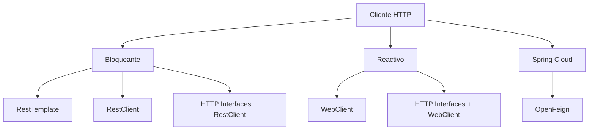

# Clientes HTTP en Spring

| Cliente | Modelo | Uso tipico |
|---|---|---|
| RestTemplate | Bloqueante | Codigo legado |
| RestClient | Bloqueante | HTTP explicito en Spring MVC moderno |
| HTTP Interfaces | Declarativo | Contratos Java para APIs HTTP |
| WebClient | Reactivo | WebFlux, streaming, alta concurrencia |
| OpenFeign | Declarativo Spring Cloud | Discovery y llamadas por nombre de servicio |

## Comparativa

| Opcion | Ventaja | Costo |
|---|---|---|
| RestTemplate | Simple y conocido | API historica |
| RestClient | Moderno y claro | Puede repetir código si hay muchos endpoints |
| HTTP Interfaces | Reduce boilerplate | Oculta parte del detalle HTTP |
| WebClient | No bloqueante | Requiere modelo reactivo |
| OpenFeign | Integrado con Spring Cloud | Agrega capa de abstracción |

## Mapa mental

## Resumen

RestTemplate pertenece sobre todo al código existente. RestClient es la opcion moderna imperativa. HTTP Interfaces agregan contratos declarativos. WebClient pertenece al mundo reactivo. OpenFeign encaja cuando ya existe Spring Cloud.
