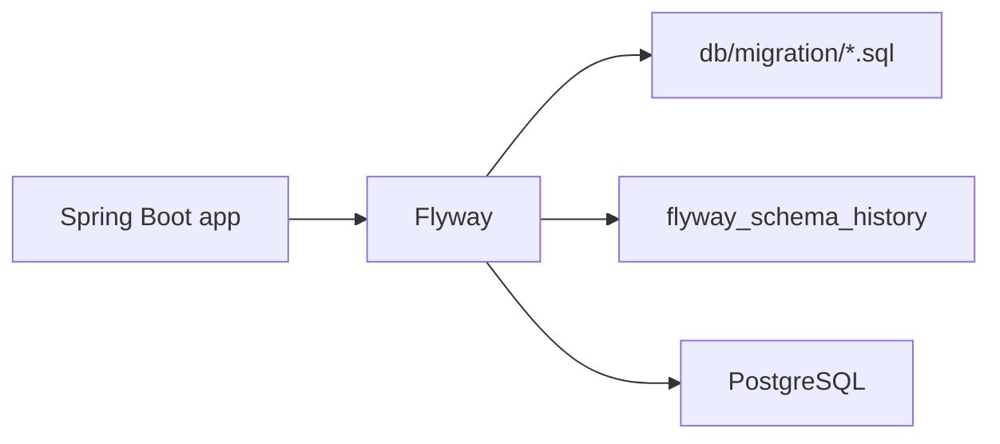

# Flyway

| Punto | Resumen |
|---|---|
| Para que sirve | Versionar cambios de base de datos |
| Formato | Scripts SQL ordenados por versión |
| Ubicacion Spring | `src/main/resources/db/migration` |
| Ejecución | Al iniciar la aplicación |
| Historial | Tabla `flyway_schema_history` |
| Regla local | Flyway cambia tablas; Hibernate valida |

## Flujo



## Nombres

| Archivo | Uso |
|---|---|
| `V1__create_courses.sql` | Primera version |
| `V2__add_course_status.sql` | Cambio posterior |
| `V3__create_course_indexes.sql` | Otro cambio posterior |

Formato:

```text
V{version}__{descripción}.sql
```

Usar doble guion bajo `__` entre version y descripción.

## Uso en este laboratorio

Cada servicio tiene sus propias migraciones:

```text
services/course-service/src/main/resources/db/migration
services/enrollment-service/src/main/resources/db/migration
services/payment-service/src/main/resources/db/migration
```

Cada servicio apunta a su propia base:

| Servicio | Base | Migracion inicial |
|---|---|---|
| `course-service` | `paideia_course` | `V1__create_courses.sql` |
| `enrollment-service` | `paideia_enrollment` | `V1__create_enrollments.sql` |
| `payment-service` | `paideia_payment` | `V1__create_payments.sql` |

## Como trabajar

1. Crear un archivo nuevo con la siguiente versión.
2. Escribir SQL reversible mentalmente y facil de revisar.
3. Levantar PostgreSQL con `docker compose up -d`.
4. Iniciar el servicio; Flyway ejecuta migraciones pendientes.
5. Revisar errores antes de escribir código que dependa del cambio.

## Reglas

| Regla | Motivo |
|---|---|
| No editar migraciones ya aplicadas | Rompe el checksum de Flyway |
| No usar `schema.sql` junto a Flyway | Mezcla dos mecanismos de inicializacion |
| No dejar Hibernate crear tablas | El esquema debe ser explicito |
| Una migracion por cambio logico | Facilita revisar y revertir con criterio |

## Checksum y la regla de inmutabilidad

Cuando Flyway aplica una migracion, calcula un hash (checksum) del contenido del archivo y lo guarda en `flyway_schema_history`. En cada arranque vuelve a calcular el checksum del archivo local y lo compara. Si difieren, el arranque falla con:

```
Migration checksum mismatch for migration version 1
-> Applied to database : 1006836066
-> Resolved locally    : -1886535910
```

Esto es intencional: garantiza que lo que está en la base de datos es exactamente lo que dicen los scripts en el repositorio.

## Configuracion clave

```properties
spring.flyway.locations=classpath:db/migration
spring.jpa.hibernate.ddl-auto=validate
spring.sql.init.mode=never
```

## Flyway vs Liquibase

| Aspecto | Flyway | Liquibase |
|---|---|---|
| Lenguaje | SQL puro o Java | SQL, XML, YAML, JSON |
| Curva aprendizaje | Muy baja | Media-alta |
| Migraciones reversibles | Manual (SQL UP/DOWN) | Automáticas con `rollback` |
| Complejidad | Ideal para simples | Para cambios complejos |
| Perf en proyectos grandes | Rápido y directo | Más overhead |
| Estrategia | Linear (V1, V2, V3...) | Tags + ramas opcionales |

**Para este proyecto**: Flyway es más que suficiente. SQL explícito es fácil de revisar y entender. Liquibase es mejor si necesitas rollbacks automáticos o cambios muy complejos.
