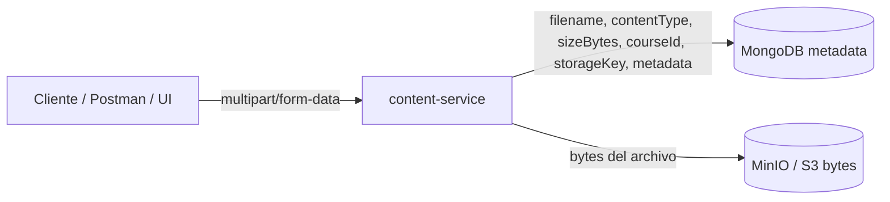
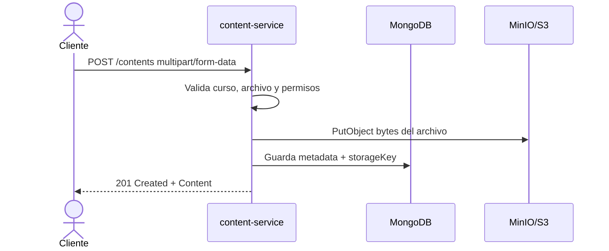
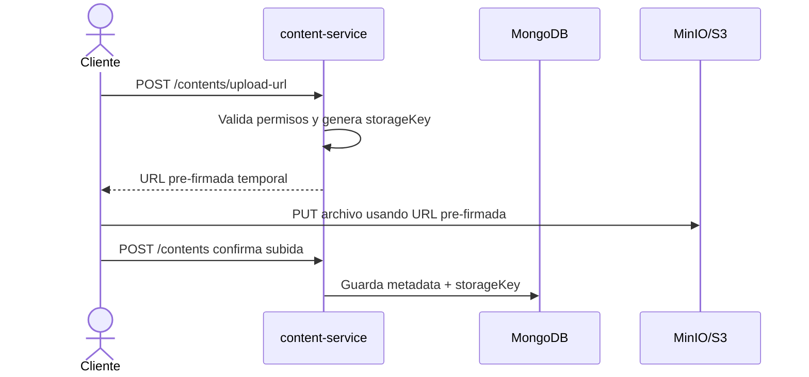
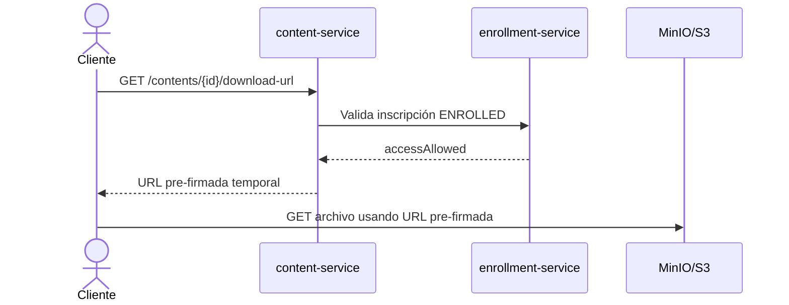

# Subida de archivos por HTTP: Base64 vs MultipartFile

Esta nota compara dos formas comunes de recibir archivos en una API HTTP: JSON con archivo codificado en Base64 y `multipart/form-data` con `MultipartFile`.

MinIO/S3 no compite directamente con Base64 o MultipartFile. Base64 y multipart definen cómo el archivo viaja desde el cliente hasta el backend. MinIO/S3 define dónde se almacena el archivo después de recibirlo.

## Resumen rápido

| Opción | Cómo viaja el archivo | Mejor para | Evitar cuando |
|---|---|---|---|
| Base64 en JSON | Un string dentro del body JSON. | Demos simples, archivos pequeños, contratos JSON puros. | Archivos medianos/grandes, streaming, UIs con selector de archivo. |
| `multipart/form-data` | Una parte binaria del request y campos adicionales. | Upload real de archivos, Postman/UI con selector, backend Spring MVC. | Contratos donde se exige JSON puro extremo a extremo. |

## Dos decisiones separadas

Al diseñar subida de archivos hay dos preguntas distintas:

| Pregunta | Opciones típicas | Qué decide |
|---|---|---|
| Cómo entra el archivo a la API | Base64 en JSON, `multipart/form-data` | Contrato HTTP entre cliente y backend. |
| Dónde vive el archivo después | Base de datos, filesystem local, MinIO/S3 | Estrategia de almacenamiento. |

Por eso `multipart/form-data` y MinIO suelen ir juntos, pero resuelven problemas diferentes:



## Base64 en JSON

El cliente lee el archivo, lo codifica como Base64 y lo envía en un JSON.

```json
{
  "courseId": "11111111-0000-0000-0000-000000000001",
  "filename": "introduccion.pdf",
  "contentType": "application/pdf",
  "contentBase64": "JVBERi0xLjQKJcfs...",
  "description": "Material introductorio del curso.",
  "metadata": {
    "pages": 12,
    "lessonNumber": 1
  }
}
```

### Ventajas

| Ventaja | Detalle |
|---|---|
| JSON puro | Todo el request es un solo documento JSON. |
| Simple de modelar | Un DTO normal con strings y UUIDs. |
| Fácil para pruebas chicas | Sirve para ejemplos didácticos y archivos mínimos. |
| Sin multipart | No requiere manejar partes HTTP. |

### Costos

| Costo | Detalle |
|---|---|
| Más peso | Base64 aumenta el tamaño aproximadamente 33%. |
| Más memoria | Cliente y backend suelen cargar el string completo en memoria. |
| Peor ergonomía en Postman | Normalmente hay que pegar el string Base64, no usar selector de archivo directo. |
| No escala bien | Para archivos grandes conviene streaming/object storage. |
| Menos natural para frontend | Una UI debe leer el archivo y transformarlo antes de enviarlo. |

## MultipartFile

El cliente envía `multipart/form-data`: campos de texto más una parte binaria llamada, por ejemplo, `file`.

```http
POST /contents
Content-Type: multipart/form-data
```

Campos:

| Campo | Tipo | Ejemplo |
|---|---|---|
| `courseId` | texto | `11111111-0000-0000-0000-000000000001` |
| `description` | texto | `Material introductorio del curso.` |
| `metadata` | texto JSON | `{"pages":12,"lessonNumber":1}` |
| `file` | archivo | `introduccion.pdf` |

En Spring MVC el controller puede recibirlo así:

```java
@PostMapping(consumes = MediaType.MULTIPART_FORM_DATA_VALUE)
public ResponseEntity<ContentResponseDTO> create(
        @RequestParam UUID courseId,
        @RequestParam(required = false) String description,
        @RequestParam(required = false) String metadata,
        @RequestPart MultipartFile file) {
    String filename = file.getOriginalFilename();
    String contentType = file.getContentType();
    long sizeBytes = file.getSize();
    byte[] bytes = file.getBytes();
    // metadata se parsea como objeto JSON flexible
    // persistir o enviar a object storage
}
```

### Ventajas

| Ventaja | Detalle |
|---|---|
| Natural para archivos | Es el formato habitual para uploads HTTP. |
| Selector en Postman | Postman muestra un picker de archivo en `form-data`. |
| Mejor para frontend | El navegador puede enviar `FormData` sin convertir a Base64. |
| Sin aumento Base64 | El archivo viaja como binario, sin el 33% extra. |
| Evoluciona mejor | Encaja con MinIO/S3 y límites de tamaño. |

### Costos

| Costo | Detalle |
|---|---|
| No es JSON puro | El contrato combina campos y archivo en partes HTTP. |
| Controller distinto | En Spring se usan `@RequestParam`, `@RequestPart` y `MultipartFile`. |
| Tests distintos | Los tests HTTP usan multipart builders, no JSON normal. |
| Validación repartida | Parte de la validación viene del archivo y parte de campos de texto. |

## MinIO / S3

MinIO es una implementación compatible con la API de Amazon S3 que se puede correr localmente con Docker. S3 es object storage: almacena objetos binarios por una clave, por ejemplo `courses/{courseId}/{contentId}/introduccion.pdf`.

En una arquitectura típica, la base de datos no guarda el archivo completo. Guarda solo los datos necesarios para encontrarlo y mostrarlo:

| Campo | Dónde vive | Ejemplo |
|---|---|---|
| `id` | MongoDB/PostgreSQL | `22222222-0000-0000-0000-000000000001` |
| `courseId` | MongoDB/PostgreSQL | `11111111-0000-0000-0000-000000000001` |
| `filename` | MongoDB/PostgreSQL | `introduccion.pdf` |
| `contentType` | MongoDB/PostgreSQL | `application/pdf` |
| `sizeBytes` | MongoDB/PostgreSQL | `204800` |
| `storageKey` | MongoDB/PostgreSQL | `courses/111.../222.../introduccion.pdf` |
| `metadata` | MongoDB/PostgreSQL | `{"pages":12,"lessonNumber":1}` |
| bytes del archivo | MinIO/S3 | objeto binario |

### Upload con backend intermediario

El flujo más simple mantiene al backend como puerta de entrada:



Ventaja: el backend controla validación, permisos, nombres de objeto y trazabilidad.

Costo: el archivo pasa por el backend; para archivos grandes puede consumir memoria y ancho de banda del servicio.

### Upload directo con URL pre-firmada

Una evolución más escalable es pedir al backend una URL temporal para subir directo a MinIO/S3.



Ventaja: el archivo grande no pasa por el backend.

Costo: el flujo es más complejo y requiere manejar confirmación, expiración y limpieza de uploads incompletos.

### Descarga con URL pre-firmada

Para descargar, el patrón habitual es que el backend valide acceso y entregue una URL temporal:



Esto evita que `content-service` haga streaming del archivo en cada descarga.

### Pros de MinIO/S3

| Ventaja | Detalle |
|---|---|
| Diseñado para archivos | Mejor que guardar binarios grandes en una base transaccional. |
| Escala mejor | Permite manejar objetos grandes y muchas descargas. |
| URLs pre-firmadas | El backend controla acceso sin servir todos los bytes. |
| Compatible con cloud | MinIO local prepara el camino para S3 real. |
| Separación clara | DB para metadata, object storage para bytes. |

### Costos de MinIO/S3

| Costo | Detalle |
|---|---|
| Más infraestructura | Requiere levantar MinIO/S3 y configurar credenciales/buckets. |
| Más casos borde | Fallas parciales: objeto subido sin metadata, metadata sin objeto, uploads incompletos. |
| Seguridad adicional | Hay que proteger buckets, credenciales y expiración de URLs. |
| Testing más amplio | Conviene usar Testcontainers o un MinIO local para integración. |


## Recomendación para este laboratorio

Para `content-service`, `multipart/form-data` es la opción más natural si desde v1 queremos decir que realmente se sube un archivo. El backend puede guardar temporalmente los bytes en base de datos o memoria local para el laboratorio, y en v7 reemplazar ese destino por MinIO/S3 sin cambiar demasiado la experiencia del cliente.

Base64 solo conviene si queremos mantener todos los endpoints como JSON por simplicidad didáctica. Si se usa Base64, conviene poner un límite chico, por ejemplo 1 MB o 5 MB, y documentarlo como solución temporal.

## Decisión sugerida

| Versión | Decisión |
|---|---|
| v1 | `POST /contents` con `multipart/form-data` y `MultipartFile`. |
| v1 | Calcular `filename`, `contentType`, `sizeBytes` y `storageKey` desde el archivo recibido; parsear `metadata` como objeto JSON flexible. |
| v1 | Guardar bytes solo con límite pequeño y como implementación didáctica. |
| v7 | Migrar almacenamiento binario a MinIO/S3 y conservar metadata/storageKey en MongoDB. |

## Regla mental

Base64 vs multipart es una decisión de transporte HTTP.

Base de datos vs MinIO/S3 es una decisión de almacenamiento.

Para una plataforma de cursos, el camino más sano suele ser:

1. `multipart/form-data` para recibir archivos.
2. Metadata en MongoDB/PostgreSQL.
3. Bytes en MinIO/S3.
4. URLs pre-firmadas para descargas.
