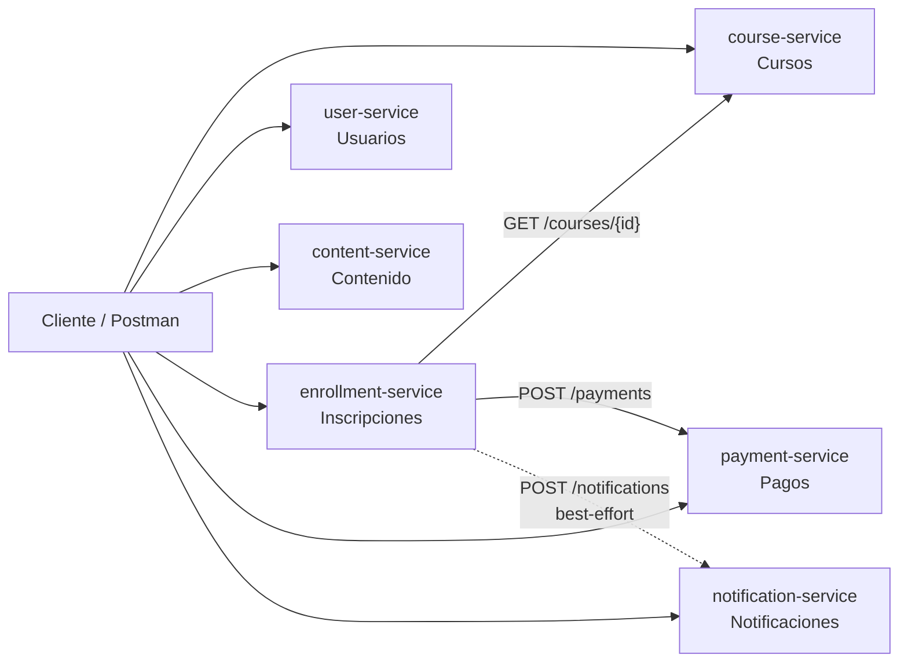
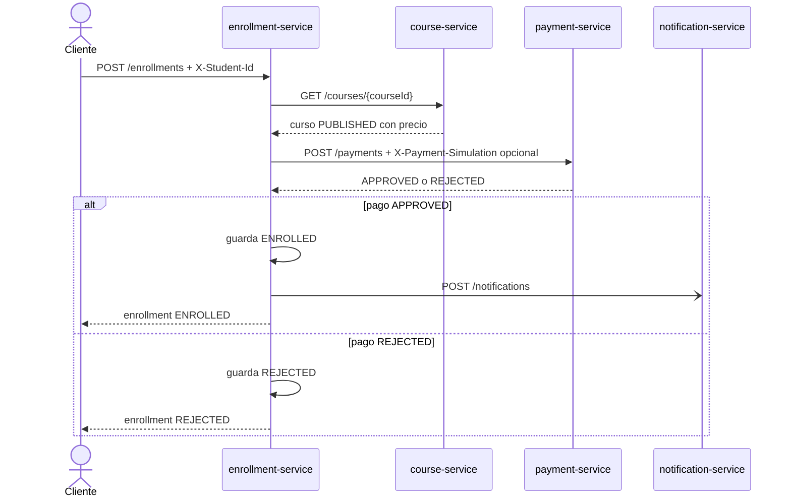
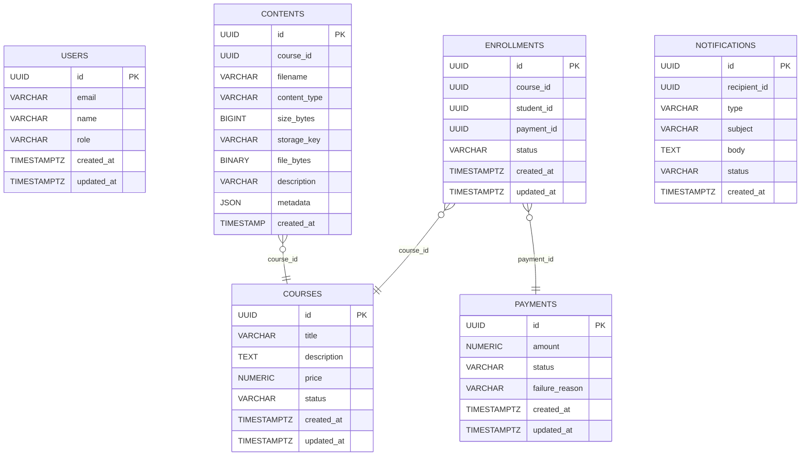

# v1 - Minimal

v1 implementa la primera versión técnica del producto Paideia: seis servicios REST, cada uno con su propia persistencia, sin gateway, seguridad, resiliencia avanzada ni mensajería asíncrona.

El comportamiento de negocio vive en [../index.md](../index.md). Este documento explica cómo se implementa esa primera versión.

## Servicios

| Servicio | Puerto | Persistencia | Responsabilidad |
|---|---:|---|---|
| `course-service` | 8081 | PostgreSQL `course` | Cursos consultables, precio y estado. |
| `enrollment-service` | 8082 | PostgreSQL `enrollment` | Orquesta inscripción, curso y pago. |
| `payment-service` | 8083 | PostgreSQL `payment` | Simula pagos aprobados o rechazados. |
| `user-service` | 8084 | PostgreSQL `user` | Registro de estudiantes y rol `ADMIN` mínimo. |
| `content-service` | 8085 | MongoDB `content` | Registro de contenidos y acceso protegido para estudiantes inscritos. |
| `notification-service` | 8086 | PostgreSQL `notification` | Registra notificaciones pendientes. |

## Vista general

## Flujo principal de inscripción

## Contratos principales

| Servicio | Endpoints clave |
|---|---|
| `course-service` | `POST /courses`, `GET /courses`, `GET /courses/{id}` |
| `user-service` | `POST /register`, `GET /users/{id}` |
| `enrollment-service` | `POST /enrollments` + `X-Student-Id`, `GET /enrollments/{id}`, `GET /enrollments/access?courseId` + `X-Student-Id` |
| `payment-service` | `POST /payments`, `GET /payments/{id}` |
| `content-service` | `POST /contents` multipart con metadata flexible, `GET /contents?courseId={courseId}` + `X-Student-Id` |
| `notification-service` | `POST /notifications`, `GET /notifications/{id}` |

`GET /courses` y `GET /courses/{id}` representan el flujo de consulta pública de cursos. La respuesta incluye el estado del curso; solo `PUBLISHED` acepta inscripciones.

En v1 no se exponen endpoints `/{recurso}/me`.

El header `X-Student-Id` solo simula identidad para operaciones que necesitan propietario, como inscribirse y validar acceso a contenido comprado.

Las vistas propias del estudiante (`GET /users/me`, `GET /enrollments/me`, `GET /notifications/me`) se agregan desde v5, cuando existe autenticación real y el estudiante se resuelve desde `Authorization: Bearer <jwt>` y el claim `paideia_user_id`.

No se incluye `GET /courses/me` porque la relación estudiante-curso vive en `enrollment-service`, no en `course-service`.

No se incluye `GET /payments/me` porque el pago no guarda `studentId`; el vínculo estudiante-pago se obtiene desde `enrollment-service`.

`GET /contents?courseId={courseId}` se mantiene separado de `/me`: es acceso al contenido de un curso específico, protegido por identidad del estudiante e inscripción `ENROLLED`.

Headers de laboratorio:

| Header | Valores | Uso |
|---|---|---|
| `X-Student-Id` | UUID | Identidad simulada para inscripción y acceso a contenido comprado. |
| `X-Payment-Simulation` | `APPROVED`, `REJECTED` | Resultado de pago forzado solo para local/test. Si no se envía, el pago simulado aprueba por defecto. |

## Modelo de datos

## Decisiones de v1

| Decision | Motivo | Evoluciona en |
|---|---|---|
| Llamadas HTTP directas entre servicios | Mantener la primera versión simple. | v2/v3 |
| Database-per-service | Practicar ownership de datos por dominio. | Se mantiene |
| `notification-service` best-effort | Mostrar acoplamiento temporal antes de eventos. | v4 |
| Sin seguridad | Primero validar comportamiento funcional. | v5 |
| `content-service` guarda binarios pequeños y metadata flexible en MongoDB | Mantener v1 simple y justificar Mongo con documentos de contenido; storage de objetos real llega después. | v7 |

## QA de v1

| Nivel | Objetivo |
|---|---|
| Unit tests | Reglas de servicio: duplicados, pagos, enrollment y acceso a contenido. |
| Postman | Smoke test manual de servicios vivos. |
| Gherkin | Documentacion viva de escenarios de negocio. |

## Limitaciones intencionales

| Limitacion | Impacto | Se aborda en |
|---|---|---|
| Sin gateway | El cliente conoce cada puerto. | v2 |
| Sin service discovery | URLs directas. | v2 |
| Sin retry, timeout avanzado ni circuit breaker | Fallos se propagan facilmente. | v3 |
| Sin idempotencia | Reintentos pueden duplicar efectos. | v3/v4 |
| Sin eventos | Notification sigue acoplado al flujo. | v4 |
| Sin autenticación/autorización real | `X-Student-Id` simula la identidad del estudiante para probar el flujo. | v5 |
| Sin trazas distribuidas | Diagnostico limitado. | v6 |
| Sin object storage | Los archivos se guardan temporalmente en MongoDB, no en MinIO/S3. | v7 |

