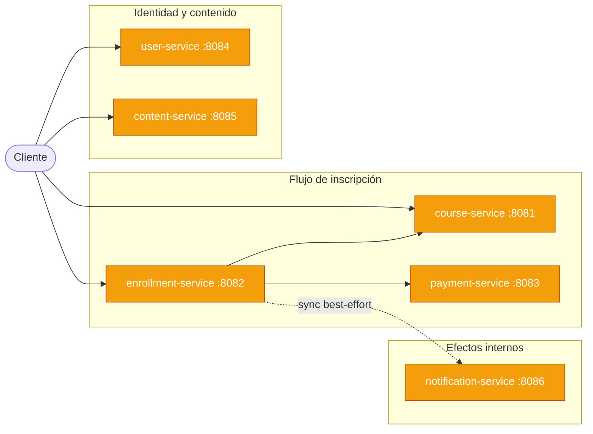
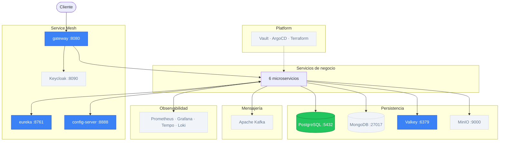

# v2 — Infrastructure

## Estado del sistema

### Servicios de negocio



<table>
  <tr>
    <td style="background:#3b82f6;color:#fff;padding:2px 8px;border-radius:4px;"><strong>Azul</strong></td>
    <td>Nuevo en esta versión</td>
    <td style="background:#f59e0b;color:#fff;padding:2px 8px;border-radius:4px;"><strong>Amarillo</strong></td>
    <td>Desarrollando</td>
    <td style="background:#22c55e;color:#fff;padding:2px 8px;border-radius:4px;"><strong>Verde</strong></td>
    <td>Terminado</td>
    <td style="background:#f1f5f9;color:#64748b;padding:2px 8px;border-radius:4px;"><strong>Gris</strong></td>
    <td>Sin cambios / no aplica</td>
  </tr>
</table>

### Infraestructura



<table>
  <tr>
    <td style="background:#3b82f6;color:#fff;padding:2px 8px;border-radius:4px;"><strong>Azul</strong></td>
    <td>Nuevo en esta versión</td>
    <td style="background:#f59e0b;color:#fff;padding:2px 8px;border-radius:4px;"><strong>Amarillo</strong></td>
    <td>Desarrollando</td>
    <td style="background:#22c55e;color:#fff;padding:2px 8px;border-radius:4px;"><strong>Verde</strong></td>
    <td>Terminado</td>
    <td style="background:#f1f5f9;color:#64748b;padding:2px 8px;border-radius:4px;"><strong>Gris</strong></td>
    <td>Sin cambios / no aplica</td>
  </tr>
</table>

---

## Por qué esta versión

v1 tiene las URLs de los servicios hardcodeadas (`localhost:8081`, `localhost:8082`…). Añadir una segunda instancia de `course-service` exige reconfigurar todos los servicios que lo llaman. Cambiar un parámetro de configuración obliga a recompilar y redesplegar. No existe un punto de entrada único — los clientes deben conocer el puerto de cada uno de los 7 servicios. Sin cache, cada consulta de cursos golpea la base de datos; sin rate limiting, el sistema está expuesto a abuso.

## Qué se construye

| Componente | Puerto | Estado | Descripción |
|---|---|---|---|
| `gateway-service` | 8080 | Nuevo | Único punto de entrada para tráfico externo |
| `discovery-server` (Eureka) | 8761 | Nuevo | Registro dinámico de instancias |
| `config-server` | 8888 | Nuevo | Configuración centralizada por entorno y servicio |
| Valkey | 6379 | Nuevo | Cache distribuida + rate limiting en gateway |
| 6 microservicios de negocio | — | Desarrollando | Actualizan URLs a service discovery; se conectan a Config Server |

---

## Diseño

### 1. API Gateway — Spring Cloud Gateway

Un nuevo servicio (`gateway-service`) actúa como único punto de entrada.
Todo el tráfico externo pasa por el puerto 8080 del gateway; los servicios de negocio
dejan de ser accesibles directamente desde fuera de la red Docker.

```
Cliente → :8080 (gateway) → :8081 course-service
                           → :8082 enrollment-service
                           → :8083 payment-service
```

El gateway enruta por prefijo de path:

| Path externo | Servicio destino |
|---|---|
| `/courses/**` | `course-service` |
| `/enrollments/**` | `enrollment-service` |
| `/payments/**` | `payment-service` |

El routing usa el nombre lógico del servicio (resuelto por Eureka), no una URL fija.

### 2. Config Server — Spring Cloud Config

Un nuevo servicio (`config-server`) sirve los `application.yml` de todos los servicios
desde un repositorio Git (o directorio local en desarrollo).

Los servicios pasan de tener su propia configuración local a arrancar así:

```
servicio arranca
  → consulta config-server: "dame config de course-service, perfil default"
  → recibe application.yml
  → continúa el arranque con esa config
```

Beneficio inmediato: cambiar el umbral de Resilience4j, el nivel de log, o una URL
de base de datos no requiere recompilar ni redesplegar la imagen del servicio.

### 3. Service Discovery — Eureka

Un nuevo servicio (`discovery-server`) mantiene el registro de instancias activas.
Cada servicio al arrancar se registra con su nombre lógico y su dirección real.

`RestClient` pasa de:
```java
// v1 — URL hardcodeada
restClient.get().uri("http://localhost:8081/courses/{id}", courseId)
```

a:
```java
// v2 — nombre lógico resuelto por Eureka + LoadBalancer
restClient.get().uri("http://course-service/courses/{id}", courseId)
```

Spring Cloud LoadBalancer intercepta la llamada, consulta Eureka, y resuelve
`course-service` → IP:puerto de la instancia activa.

### 4. Valkey — Cache distribuida

Valkey es el fork open-source de Redis (Linux Foundation, 2024). Es 100% compatible
con los clientes existentes de Redis y es la opción correcta para proyectos open-source.

En v2 se usa para dos responsabilidades concretas:

**Cache de cursos (cache-aside en `course-service`):**

```
GET /courses/{id}
  → ¿existe en Valkey?  → Sí → retorna desde cache (hit)
                         → No → consulta DB → guarda en Valkey con TTL 5m (miss)
```

El patrón cache-aside es el más común: la aplicación gestiona el cache manualmente.
Si el dato no está en cache, lo busca en DB y lo escribe en cache.
Si el curso se actualiza, se invalida la entrada en Valkey.

**Rate limiting en el Gateway:**

El Gateway usa Valkey para contar requests por IP o por cliente en una ventana de tiempo.
Si un cliente supera el límite (ej: 100 req/min), el Gateway devuelve 429 Too Many Requests
sin que la petición llegue a los servicios de negocio.

Esto usa el algoritmo **token bucket** almacenado en Valkey:
```
cada cliente tiene un bucket con N tokens
cada request consume 1 token
los tokens se recargan a razón de R tokens/segundo
si el bucket está vacío → 429
```

**Preparación para v3 (locks distribuidos):**

Valkey también será la base para los locks distribuidos de idempotencia en v3.
En lugar de hacer una query a la DB para verificar si un `idempotency_key` ya existe,
se usa `SET NX EX` en Valkey (atomic set-if-not-exists con expirado).

---

### Nuevos servicios de infraestructura

| Servicio | Puerto | Tecnología | Rol |
|---|---|---|---|
| `config-server` | 8888 | Spring Cloud Config Server | Sirve configuración centralizada |
| `discovery-server` | 8761 | Netflix Eureka Server | Registro de instancias |
| `gateway-service` | 8080 | Spring Cloud Gateway | Punto único de entrada |
| Valkey | 6379 | Cache distribuida | Cache, rate limiting, base para locks |

Los servicios de negocio no cambian de puerto interno; solo dejan de ser accesibles externamente.

---

### Dependencias agregadas a los servicios de negocio

```xml
<!-- Registrarse en Eureka y usar LoadBalancer -->
<dependency>
    <groupId>org.springframework.cloud</groupId>
    <artifactId>spring-cloud-starter-netflix-eureka-client</artifactId>
</dependency>

<!-- Obtener config desde Config Server al arrancar -->
<dependency>
    <groupId>org.springframework.cloud</groupId>
    <artifactId>spring-cloud-starter-config</artifactId>
</dependency>

<!-- Cache con Valkey (cliente Lettuce, compatible Redis) -->
<dependency>
    <groupId>org.springframework.boot</groupId>
    <artifactId>spring-boot-starter-data-redis</artifactId>
</dependency>
```

---

## Limitaciones intencionales

| Limitación | Impacto | Se aborda en |
|---|---|---|
| Sin circuit breaker ni retry | Fallo transitorio deja el flujo incompleto | v3 |
| Sin idempotencia | Doble llamada puede crear dos pagos o dos inscripciones | v3 |
| Sin autenticación ni autorización | Cualquiera puede usar el API | v5 |
| Secrets en Config Server sin cifrado | DB passwords accesibles si Config Server es comprometido | v8 (Vault) |
| Gateway sin validación de token | El gateway propaga requests sin verificar la firma del JWT | v5 |

---

## Conceptos de estudio

**Caching: cache-aside, TTL, invalidación y cache stampede**
Cache-aside significa que la app gestiona el cache manualmente: busca en cache, si falta busca en DB y escribe en cache.
El TTL (time-to-live) controla cuánto tiempo vive una entrada: si expira y muchos clientes la piden a la vez,
todos van a la DB simultáneamente (cache stampede). La solución es probabilistic early expiration o un lock
para que solo uno recargue el cache.

**Rate limiting: por qué en el Gateway y no en cada servicio**
Poner rate limiting en el Gateway significa implementarlo una sola vez para todos los servicios.
Si lo pusieras en cada servicio, necesitarías coordinar los contadores entre instancias (por eso Valkey,
que es compartido), y duplicar la lógica en cada servicio.

**Service Discovery: registro dinámico y escalamiento horizontal**
Con URL fija, levantar una segunda instancia de `course-service` en otro puerto requiere
actualizar la config de quien la llama. Con Eureka, la segunda instancia se registra sola
y LoadBalancer la incluye automáticamente en la rotación (round-robin por defecto).

Esto permite **escalamiento horizontal transparente**: `enrollment-service` no necesita cambio alguno
cuando pasan de existir una a tres instancias de `course-service`. El requisito es que los servicios
sean sin estado — ningún dato de sesión en memoria local.

```bash
# Levantar tres instancias de course-service (Docker Compose)
docker compose up --scale course-service=3
# Las tres se registran en Eureka; LoadBalancer las incluye automáticamente
```

En v7 (Kubernetes), el HPA (HorizontalPodAutoscaler) automatiza el escalado basado en métricas de CPU/memoria.

**Hot reload, `@RefreshScope` y feature flags**
Los beans anotados con `@RefreshScope` son destruidos y recreados cuando se llama a
`POST /actuator/refresh`. Eso significa que las propiedades se releen desde el Config Server
**sin reiniciar el servicio**:

```java
@RefreshScope
@Component
public class FeatureFlags {
    @Value("${feature.new-payment-flow:false}")
    private boolean newPaymentFlow;
}
```

Para propagar el refresh a **todas las instancias simultáneamente** sin llamar al endpoint
en cada una, se usa **Spring Cloud Bus**: publica un evento de refresh en Kafka (o RabbitMQ)
que cada instancia consume para refrescar su propio contexto.

El patrón de **feature flags** emerge de forma natural: una propiedad
`feature.X.enabled: true/false` en el Config Server activa o desactiva funcionalidad
en producción sin redesplegar ningún artefacto.

```yaml
# En el repositorio de configuración (Git)
feature:
  new-payment-flow: false     # false → comportamiento actual; true → nuevo flujo
```

**Config Server y 12-factor app (factor III: Config)**
El factor III dice que la config que varía entre entornos (dev, staging, prod) no debe
estar en el código. Config Server materializa ese principio: el mismo artefacto (JAR/imagen)
arranca con config distinta según el perfil que se le pase.

**API Gateway como cross-cutting concern**
Funcionalidades que aplican a todos los servicios (rate limiting, correlación de requests,
autenticación — en v5) se implementan una vez en el gateway, no en cada servicio.

---

## Alternativas sugeridas

| Branch | Base | Qué explora |
|---|---|---|
| `alt/consul` | `v2.0.0` | Consul como alternativa unificada (discovery + config + KV) |
| `alt/grpc` | `v2.0.0` | gRPC para comunicación interna vs RestClient HTTP |


