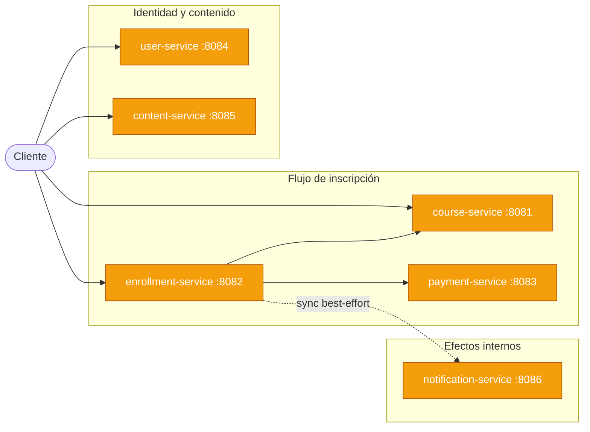
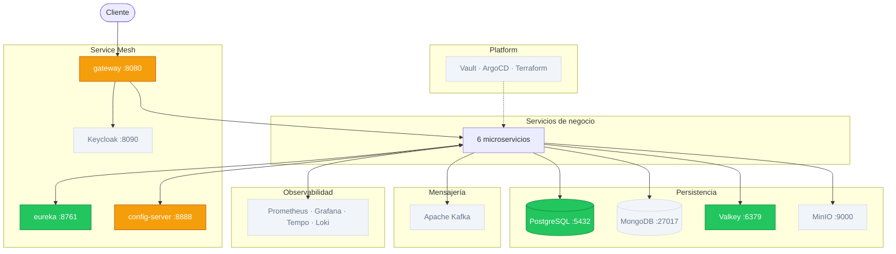

# v3 — Resilience

## Estado del sistema

### Servicios de negocio



<table>
  <tr>
    <td style="background:#3b82f6;color:#fff;padding:2px 8px;border-radius:4px;"><strong>Azul</strong></td>
    <td>Nuevo en esta versión</td>
    <td style="background:#f59e0b;color:#fff;padding:2px 8px;border-radius:4px;"><strong>Amarillo</strong></td>
    <td>Desarrollando</td>
    <td style="background:#22c55e;color:#fff;padding:2px 8px;border-radius:4px;"><strong>Verde</strong></td>
    <td>Terminado</td>
    <td style="background:#f1f5f9;color:#64748b;padding:2px 8px;border-radius:4px;"><strong>Gris</strong></td>
    <td>Sin cambios / no aplica</td>
  </tr>
</table>

### Infraestructura



<table>
  <tr>
    <td style="background:#3b82f6;color:#fff;padding:2px 8px;border-radius:4px;"><strong>Azul</strong></td>
    <td>Nuevo en esta versión</td>
    <td style="background:#f59e0b;color:#fff;padding:2px 8px;border-radius:4px;"><strong>Amarillo</strong></td>
    <td>Desarrollando</td>
    <td style="background:#22c55e;color:#fff;padding:2px 8px;border-radius:4px;"><strong>Verde</strong></td>
    <td>Terminado</td>
    <td style="background:#f1f5f9;color:#64748b;padding:2px 8px;border-radius:4px;"><strong>Gris</strong></td>
    <td>Sin cambios / no aplica</td>
  </tr>
</table>

---

## Por qué esta versión

v2 no tiene ninguna protección ante fallos de dependencias. Si `payment-service` se vuelve lento, los threads de `enrollment-service` se acumulan esperando respuesta hasta que el pool se agota — y `enrollment-service` deja de responder aunque su lógica esté sana. Un error transitorio de red no se reintenta. Sin idempotencia en pagos, un retry automático genera cobros duplicados.

v3 responde con cuatro mecanismos independientes: circuit breaker para cortar cascadas, retry con backoff exponencial para errores transitorios, timeout para evitar esperas indefinidas, y un campo `idempotency_key` en pagos para hacer los reintentos seguros.

## Qué se construye

| Componente | Estado | Descripción |
|---|---|---|
| Resilience4j (circuit breaker + retry + timeout) | Nuevo | Patrones de resiliencia en llamadas enrollment→course y enrollment→payment |
| Idempotencia en `payment-service` | Nuevo | Campo `idempotency_key` + lock atómico en Valkey |
| `enrollment-service`, `course-service`, `payment-service` | Desarrollando | Incorporan resiliencia; payment incorpora idempotencia |
| gateway, Eureka, Config Server, PostgreSQL | Terminado | Parámetros de resiliencia externalizados al Config Server |
| Valkey | Terminado | Añade rol de lock distribuido para idempotencia |

---

## Diseño

### 1. Circuit Breaker

Resilience4j envuelve cada llamada saliente de `enrollment-service` a `course-service`
y a `payment-service` con un circuit breaker.

```
Estado CLOSED → llamadas pasan normalmente
               → si X% fallan en ventana de N llamadas → pasa a OPEN

Estado OPEN → llamadas se cortan inmediatamente (no se intenta la red)
            → después de T segundos → pasa a HALF-OPEN

Estado HALF-OPEN → se permiten K llamadas de prueba
                 → si tienen éxito → vuelve a CLOSED
                 → si fallan → vuelve a OPEN
```

El servicio destino tiene tiempo de recuperarse sin recibir más carga mientras el circuito está abierto.

### 2. Retry con backoff exponencial

Para errores transitorios (timeout puntual, restart de pod), Resilience4j reintenta
automáticamente con espera creciente entre intentos:

```
Intento 1 → falla → espera 500ms
Intento 2 → falla → espera 1000ms
Intento 3 → falla → espera 2000ms
Intento 4 → falla → se lanza la excepción al caller
```

El backoff evita que un servicio degradado reciba una avalancha de reintentos simultáneos
(thundering herd problem).

### 3. Timeout

Cada llamada HTTP tiene un timeout configurado. Si `payment-service` no responde en 3s,
la llamada se cancela con excepción, liberando el thread.

Sin timeout, un servicio lento puede hacer que los threads de `enrollment-service`
se acumulen esperando, hasta agotar el pool y hacer que enrollment-service también deje
de responder — aunque su lógica propia esté completamente sana.

### 4. Fallback

Cuando el circuit breaker está abierto (o se agota el retry), en lugar de propagar
la excepción al cliente se puede retornar una respuesta degradada predefinida.

En este lab, el fallback de `payment-service` retorna un objeto `PaymentResponse`
con `status=UNAVAILABLE`, y `enrollment-service` responde con `status=PENDING`
en lugar de un 503. El cliente sabe que la operación está en espera, no que el sistema está caído.

### 5. Idempotencia en payments con Valkey

Con retry activo, una misma solicitud de pago puede llegar más de una vez a `payment-service`.
Sin idempotencia, eso genera cobros duplicados.

Se agrega un campo `idempotency_key` (UUID generado por `enrollment-service`) en
la tabla `payments`. Para verificar eficientemente si ya existe un pago con esa clave,
se usa Valkey como lock distribuido atómico **antes** de consultar la DB:

```
POST /payments
X-Payment-Simulation: APPROVED
{ idempotencyKey: "a4f3d2c1-..." }
  → SET NX EX 30 "idempotency:a4f3d2c1-..."   (atómico en Valkey)
    → si OK (lock obtenido): procesar y persistir en DB
    → si FAIL (lock existe): buscar en DB y retornar resultado previo
```

`SET NX EX` en Valkey es una operación atómica: setea la clave solo si no existe,
con expirado de 30s. Si dos requests llegan simultáneamente con la misma clave,
solo uno obtiene el lock; el otro espera y luego lee el resultado de DB.

Esto es más eficiente que ir directo a DB: Valkey responde en < 1ms frente a una
query SQL con índice que puede tardar 5-10ms, y evita contención en la DB bajo carga.

```
POST /payments
X-Payment-Simulation: APPROVED
{
  "amount": 99.99,
  "idempotencyKey": "a4f3d2c1-..."
}
```

---

### Configuración en Config Server

Los parámetros de resiliencia viven en el Config Server, no en el código:

```yaml
resilience4j:
  circuitbreaker:
    instances:
      payment-service:
        slidingWindowSize: 10
        failureRateThreshold: 50
        waitDurationInOpenState: 10s
  retry:
    instances:
      payment-service:
        maxAttempts: 3
        waitDuration: 500ms
        enableExponentialBackoff: true
  timelimiter:
    instances:
      payment-service:
        timeoutDuration: 3s
```

Cambiar estos valores no requiere recompilar ni redesplegar.

---

## Limitaciones intencionales

| Limitación | Impacto | Se aborda en |
|---|---|---|
| Comunicación aún sincónica (HTTP) entre enrollment y notification | Fallo en notification puede bloquear el hilo de enrollment | v4 (Kafka) |
| Sin garantía de consistencia en fallo parcial post-retry | Si payment aprueba pero enrollment falla al persistir, el pago queda huérfano | v4 (Saga + Outbox) |

---

## Conceptos de estudio

**CAP Theorem**
En presencia de una partición de red, un sistema distribuido debe elegir entre
Consistencia (todos ven el mismo dato) o Disponibilidad (siempre responde).
Circuit breaker es una decisión explícita de priorizar disponibilidad:
el sistema responde (degradado) aunque no pueda garantizar consistencia con el servicio caído.

**At-least-once delivery y sus consecuencias**
Retry implica que un mensaje o request puede llegar más de una vez al destino.
El receptor debe ser idempotente: procesar el mismo input N veces debe tener el mismo
efecto que procesarlo una vez. `idempotency_key` es la materialización de eso en este lab.

**Thundering herd**
Sin backoff, todos los clientes reintentan al mismo tiempo, generando un pico de carga
sobre el servicio que intenta recuperarse. El backoff exponencial + jitter distribuye
los reintentos en el tiempo.


