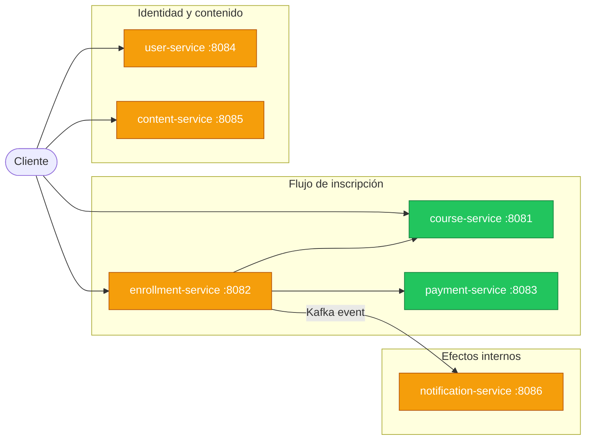
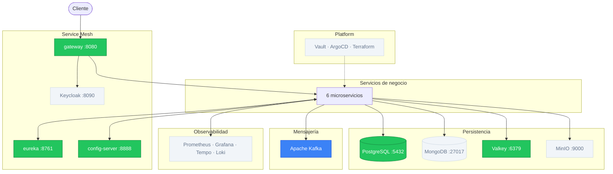

# v4 — EDA

## Estado del sistema

### Servicios de negocio



<table>
  <tr>
    <td style="background:#3b82f6;color:#fff;padding:2px 8px;border-radius:4px;"><strong>Azul</strong></td>
    <td>Nuevo en esta versión</td>
    <td style="background:#f59e0b;color:#fff;padding:2px 8px;border-radius:4px;"><strong>Amarillo</strong></td>
    <td>Desarrollando</td>
    <td style="background:#22c55e;color:#fff;padding:2px 8px;border-radius:4px;"><strong>Verde</strong></td>
    <td>Terminado</td>
    <td style="background:#f1f5f9;color:#64748b;padding:2px 8px;border-radius:4px;"><strong>Gris</strong></td>
    <td>Sin cambios / no aplica</td>
  </tr>
</table>

### Infraestructura



<table>
  <tr>
    <td style="background:#3b82f6;color:#fff;padding:2px 8px;border-radius:4px;"><strong>Azul</strong></td>
    <td>Nuevo en esta versión</td>
    <td style="background:#f59e0b;color:#fff;padding:2px 8px;border-radius:4px;"><strong>Amarillo</strong></td>
    <td>Desarrollando</td>
    <td style="background:#22c55e;color:#fff;padding:2px 8px;border-radius:4px;"><strong>Verde</strong></td>
    <td>Terminado</td>
    <td style="background:#f1f5f9;color:#64748b;padding:2px 8px;border-radius:4px;"><strong>Gris</strong></td>
    <td>Sin cambios / no aplica</td>
  </tr>
</table>

---

## Por qué esta versión

`notification-service` es una llamada síncrona desde `enrollment-service`. Si `notification-service` no responde, la inscripción puede quedar acoplada a un efecto secundario que no debería bloquear el flujo principal. Añadir un nuevo consumidor del evento de confirmación (por ejemplo, un sistema de analitica) requiere modificar `enrollment-service`.

v4 introduce un bus de eventos Kafka. `enrollment-service` publica eventos y `notification-service` los consume de forma independiente. Añadir un nuevo consumidor no requiere tocar el productor.

## Qué se construye

| Componente | Puerto | Estado | Descripción |
|---|---|---|---|
| Apache Kafka | — | Nuevo | Bus de eventos: enrollment->payment (saga), enrollment->notification |
| `notification-service` | 8086 | Desarrollando | Implementación real como consumer Kafka; antes era stub |
| `enrollment-service` | 8082 | Desarrollando | Saga choreography + outbox pattern; reemplaza llamadas síncronas |

---

## Diseño

Se agrega Kafka al Docker Compose. Los servicios se comunican publicando y consumiendo
eventos en topics, en lugar de llamarse directamente.

```
enrollment-service  →  topic: enrollment.requested  →  payment-service
payment-service     →  topic: payment.processed     →  enrollment-service
```

Ventajas inmediatas:
- `enrollment-service` no espera: publica el evento y libera el thread
- `payment-service` puede estar caído; los eventos se acumulan en Kafka y se procesan cuando recupera
- Los servicios no se conocen entre sí — solo conocen los topics

### 2. Saga pattern (choreography-based)

Una transacción distribuida en microservicios no puede usar 2PC (Two-Phase Commit):
es demasiado frágil y acoplado. El patrón Saga la reemplaza con una secuencia de
transacciones locales compensables.

**Flujo feliz:**
```
1. enrollment-service persiste enrollment con status=PENDING
2. enrollment-service publica EnrollmentRequested
3. payment-service consume EnrollmentRequested
4. payment-service procesa el pago, persiste PaymentEntity
5. payment-service publica PaymentProcessed(status=APPROVED)
6. enrollment-service consume PaymentProcessed
7. enrollment-service actualiza enrollment a status=CONFIRMED
```

**Flujo de compensación (pago rechazado):**
```
5b. payment-service publica PaymentProcessed(status=REJECTED)
6b. enrollment-service consume PaymentProcessed
7b. enrollment-service actualiza enrollment a status=REJECTED
    (no hay cobro que revertir porque el pago fue rechazado directamente)
```

Cada servicio solo ejecuta su transacción local. La coordinación emerge de los eventos,
no de un orquestador central.

### 3. Outbox pattern

Publicar un evento en Kafka y persistir en la base de datos son dos operaciones distintas.
Si el servicio persiste el enrollment y luego cae antes de publicar el evento, Kafka nunca
recibe el mensaje y la saga queda bloqueada.

El Outbox pattern resuelve esto:

```
BEGIN TRANSACTION
  INSERT INTO enrollments (...) → enrollment persiste
  INSERT INTO outbox (event_type, payload) → evento persiste en la misma DB
COMMIT

[scheduler/Kafka Connect lee outbox, publica a Kafka y marca el evento como publicado]
```

El evento se garantiza porque vive en la misma transacción que el enrollment.
Si el servicio cae después del COMMIT, el scheduler lo publicará en el siguiente ciclo.

### 4. Idempotent consumers

Con Kafka, un evento puede ser consumido más de una vez (rebalanceo de particiones,
restart del consumer antes de hacer commit del offset).

Cada consumer verifica si ya procesó el evento antes de actuar:

```java
if (eventRepository.existsByEventId(event.getId())) {
    return; // ya procesado, ignorar
}
// procesar...
eventRepository.save(new ProcessedEvent(event.getId()));
```

---

### Eventos del dominio

| Topic | Productor | Payload | Consumidor |
|---|---|---|---|
| `enrollment.requested` | enrollment-service | `{enrollmentId, courseId, amount, idempotencyKey}` | payment-service |
| `payment.processed` | payment-service | `{enrollmentId, paymentId, status, failureReason}` | enrollment-service |
| `enrollment.confirmed` | enrollment-service | `{enrollmentId, courseId, studentId, amount}` | notification-service |

Metadata técnica de eventos:

| Metadata | Origen | Uso |
|---|---|---|
| `paymentSimulation` | Header `X-Payment-Simulation` en local/test | Permite a `payment-service` forzar `APPROVED` o `REJECTED` sin contaminar el payload de dominio. |

---

### Fan-out futuro

El evento `enrollment.confirmed` queda preparado para **fan-out**: un productor,
multiples consumers independientes. Kafka lo soporta de forma nativa mediante
**consumer groups**: cada consumer group recibe una copia del evento.

```
enrollment.confirmed (topic)
  → consumer group: notification-group  → notification-service procesa
  → consumer group: analytics-group     → analytics-service procesa (futuro)
```

Esto demuestra una ventaja clave de la mensajería: `enrollment-service` no sabe nada
de `notification-service` como implementación concreta. Cuando se agregue otro
consumer (analytics, por ejemplo), no hay que modificar nada en enrollment.

### notification-service

Servicio sin API HTTP propia. Solo consume eventos de Kafka.

```
EnrollmentConfirmed → busca datos del usuario (llama a user-service en v5)
                     → genera email de confirmación
                     → envía via SMTP / SendGrid / SES
```

En v4, el destinatario se identifica por `studentId` en el payload del evento, originado desde el header `X-Student-Id`.
En v5, cuando existe `user-service`, se resuelve el email real del usuario desde ese servicio.

## Limitaciones intencionales

| Limitación | Impacto | Se aborda en |
|---|---|---|
| Sin autenticación en los endpoints | Cualquiera puede publicar eventos o consultar datos de otros | v5 |
| Sin autenticación entre servicios en Kafka | Los topics no tienen SASL ni ACLs | v8 (mTLS / SASL para Kafka) |

---

## Conceptos de estudio

**Consistencia eventual**
El enrollment no está confirmado en el momento en que el cliente recibe el 202 Accepted.
Estará confirmado cuando el evento llegue y se procese, que puede ser milisegundos o segundos después.
Es un trade-off aceptable en muchos dominios (inscripciones, pedidos, notificaciones).
No es aceptable en transferencias bancarias en tiempo real.

**Choreography vs Orchestration**
En choreography (este lab), cada servicio conoce los eventos a los que reacciona.
No hay un componente central que diga "ahora ve tú, luego tú".
Ventaja: menos acoplamiento. Desventaja: el flujo completo solo se entiende leyendo todos los servicios.

En orchestration (estudio sugerido con Temporal), un proceso central coordina explícitamente.
Ventaja: el flujo es visible en un solo lugar. Desventaja: el orquestador es un punto central de fallo.

**Outbox pattern y at-least-once**
El outbox garantiza que el evento *se publicará*, pero puede publicarse más de una vez
(si el scheduler falla entre publicar y borrar la fila). Por eso los consumers deben ser idempotentes.
La combinación outbox + idempotent consumers es la garantía real de exactly-once semántico.

---

## Alternativas sugeridas

**`alt/rabbitmq` — RabbitMQ vs Kafka**

| | Kafka | RabbitMQ |
|---|---|---|
| Modelo | Log inmutable; consumers leen a su ritmo (pull) | Queue; el broker entrega al consumer (push) |
| Replay | Sí — rewind del offset | No — el mensaje se elimina al consumirse |
| Throughput | Muy alto (millones/s) | Alto (decenas de miles/s) |
| Complejidad | Mayor (topics, particiones, offsets, grupos) | Menor (exchanges, queues, bindings) |
| Ideal para | Event sourcing, audit log, múltiples consumers del mismo evento | Task queues, workflows, routing complejo |

Base: `v4.0.0` — se reemplaza Kafka por RabbitMQ en producers y consumers.

**`alt/orchestration-saga` — Temporal como orquestador**

Temporal es un motor de workflows duraderos. La saga se escribe como código Java normal
con `try/catch/compensate` en lugar de reaccionar a eventos. El estado del workflow persiste
automáticamente — si el proceso cae a mitad, Temporal lo retoma desde donde estaba.
Base: `v4.0.0`.

**`alt/order-flow` — Saga más larga con order-service**

Rediseño del flujo de negocio: se agrega `order-service` con estado de carrito y orden.
La saga pasa de 2 pasos a 4: CreateOrder → ValidateCourse → ProcessPayment → ConfirmEnrollment.
Permite practicar una saga más larga con más transacciones de compensación.
Base: `v4.0.0`.

**`alt/cqrs` — CQRS con modelo de lectura separado**

Se agrega un modelo de lectura para búsqueda de cursos: `GET /courses?q=java` necesita
full-text search que SQL no resuelve bien. Se crea un consumidor Kafka que escucha
cambios en cursos y actualiza un índice Elasticsearch / OpenSearch.
El servicio de escritura (`course-service`) no cambia; se agrega un read model separado.
Base: `v4.0.0`.


