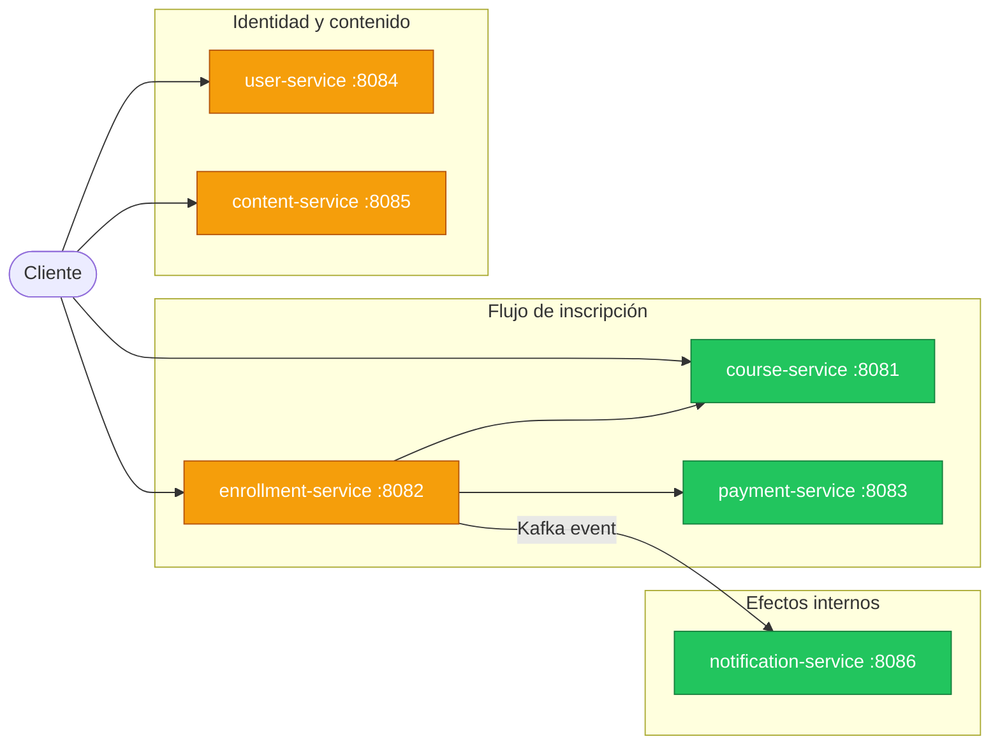
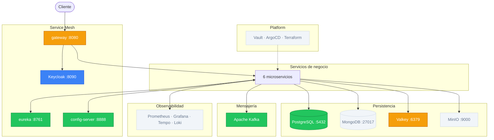

# v5 — Security

## Estado del sistema

### Servicios de negocio



<table>
  <tr>
    <td style="background:#3b82f6;color:#fff;padding:2px 8px;border-radius:4px;"><strong>Azul</strong></td>
    <td>Nuevo en esta versión</td>
    <td style="background:#f59e0b;color:#fff;padding:2px 8px;border-radius:4px;"><strong>Amarillo</strong></td>
    <td>Desarrollando</td>
    <td style="background:#22c55e;color:#fff;padding:2px 8px;border-radius:4px;"><strong>Verde</strong></td>
    <td>Terminado</td>
    <td style="background:#f1f5f9;color:#64748b;padding:2px 8px;border-radius:4px;"><strong>Gris</strong></td>
    <td>Sin cambios / no aplica</td>
  </tr>
</table>

### Infraestructura



<table>
  <tr>
    <td style="background:#3b82f6;color:#fff;padding:2px 8px;border-radius:4px;"><strong>Azul</strong></td>
    <td>Nuevo en esta versión</td>
    <td style="background:#f59e0b;color:#fff;padding:2px 8px;border-radius:4px;"><strong>Amarillo</strong></td>
    <td>Desarrollando</td>
    <td style="background:#22c55e;color:#fff;padding:2px 8px;border-radius:4px;"><strong>Verde</strong></td>
    <td>Terminado</td>
    <td style="background:#f1f5f9;color:#64748b;padding:2px 8px;border-radius:4px;"><strong>Gris</strong></td>
    <td>Sin cambios / no aplica</td>
  </tr>
</table>

---

## Por qué esta versión

Hasta v4, cualquier persona puede crear cursos, inscribirse como cualquier usuario, o consultar pagos ajenos. El header `X-Student-Id` transporta un UUID libre sin validación: no existe ningún mecanismo que verifique que la identidad es correcta. Las llamadas entre servicios son completamente anónimas.

v5 delega la autenticación a Keycloak. Un realm `paideia` concentra usuarios, roles y emisión de tokens JWT/OIDC. Los servicios son Resource Servers que validan el token en cada petición sin mantener estado de sesión.

## Qué se construye

| Componente | Puerto | Estado | Descripción |
|---|---|---|---|
| Keycloak | 8090 | Nuevo | Identity Provider; realm `paideia`, usuarios estudiante/admin y tokens |
| `user-service` | 8084 | Desarrollando | Implementación real: perfil extendido con ID propio y vínculo al `sub` de Keycloak |
| `course-service`, `enrollment-service`, `content-service` | 8081/8082/8085 | Desarrollando | Añaden validación de JWT, `ROLE_ADMIN` mínimo y autorización por estudiante propietario |
| `gateway-service` | 8080 | Desarrollando | Configurado como OAuth2 Resource Server; propaga identidad a los servicios |

---

## Diseño

### 1. Keycloak como Identity Provider

En lugar de implementar un `auth-service` con JWT propio, v5 delega la autenticación
a Keycloak. Un realm `paideia` concentra usuarios, roles y la emisión de tokens JWT/OIDC.

Esto elimina la necesidad de gestionar firmas de token, rotación de claves y lógica
de autenticación desde código propio.

```
Keycloak :8090
  └── Realm: paideia
      ├── Clients: gateway, enrollment-svc, course-svc, ...
      ├── Roles:   ROLE_STUDENT, ROLE_ADMIN
      └── Users:   gestionados por Keycloak o importados desde user-service
```

### 2. Gateway como OAuth2 Resource Server

Spring Cloud Gateway configura Spring Security como Resource Server.
El JWT emitido por Keycloak se valida con la clave pública del realm
(auto-discovery via OIDC `/.well-known/openid-configuration`).

```yaml
spring:
  security:
    oauth2:
      resourceserver:
        jwt:
          issuer-uri: http://keycloak:8090/realms/paideia
```

```
Request → Gateway
  → extrae Authorization: Bearer <token>
  → valida firma con jwks-uri de Keycloak
  → si válido: propaga el JWT al servicio destino
  → si inválido: retorna 401 Unauthorized
```

Los servicios de negocio validan el JWT como Resource Servers y extraen la identidad
desde el claim `paideia_user_id`, sin consultar `user-service` en cada request.

### 3. Autorización por identidad y propiedad

Cada endpoint protegido valida identidad y propiedad del recurso:

v5 introduce las vistas propias `/{recurso}/me`. En v1-v4 no existen estos endpoints porque `X-Student-Id` solo simula identidad y no prueba autenticación real.

| Endpoint | Regla requerida |
|---|---|
| `POST /register` | Público; crea cuenta estudiante. |
| `GET /users/me` | `ROLE_STUDENT`; el perfil se resuelve desde `paideia_user_id`. |
| `GET /users/{id}` | `ROLE_ADMIN`; consulta administrativa de usuario. |
| `GET /courses`, `GET /courses/{id}` | Público. |
| `POST /courses` | `ROLE_ADMIN`. |
| `POST /enrollments` | Estudiante autenticado; `studentId` se toma del claim `paideia_user_id`. |
| `GET /enrollments/me` | `ROLE_STUDENT`; lista inscripciones propias desde `paideia_user_id`. |
| `GET /enrollments/{id}` | `ROLE_ADMIN` o servicio interno autorizado. |
| `GET /payments/{id}` | `ROLE_ADMIN` o servicio interno autorizado. |
| `GET /notifications/me` | `ROLE_STUDENT`; lista notificaciones propias desde `paideia_user_id`. |
| `GET /notifications/{id}` | `ROLE_ADMIN` o servicio interno autorizado. |
| `GET /contents?courseId={courseId}` | `ROLE_STUDENT`; propietario con inscripción `ENROLLED`. |

```java
@PreAuthorize("hasRole('ADMIN')")
@PostMapping("/courses")
public ResponseEntity<CourseResponseDTO> create(...) { ... }
```

### 4. Service-to-service auth (client credentials)

Las llamadas internas también se autentican con el flujo `client_credentials` de Keycloak:

```
enrollment-service → POST /realms/paideia/protocol/openid-connect/token
                     { grant_type: client_credentials, client_id: ..., client_secret: ... }
                   → recibe token con scope "internal"
                   → adjunta token en llamadas a otros servicios
```

Zero-trust: ningún servicio confía en una llamada solo porque venga de dentro de la red.

---

### Claims del JWT

```json
{
  "sub": "keycloak-subject",
  "paideia_user_id": "user-service-user-uuid",
  "realm_access": { "roles": ["ROLE_STUDENT"] },
  "iss": "http://keycloak:8090/realms/paideia",
  "iat": 1716000000,
  "exp": 1716003600
}
```

Los servicios mapean `realm_access.roles` a authorities de Spring Security con
un `JwtAuthenticationConverter` configurado en cada servicio.

---

### 5. user-service

`user-service` actúa como registro de perfiles extendidos: datos que Keycloak no gestiona
(preferencias, historial, configuración de notificaciones).

El `sub` del JWT identifica al usuario dentro de Keycloak. El identificador de negocio
de Paideia es `user-service.id`, expuesto en el token como claim `paideia_user_id`.
`user-service` mantiene el vínculo entre ambos valores.

### Responsabilidades

| Endpoint | Descripción |
|---|---|
| `POST /register` | Registro público de estudiante |
| `GET /users/me` | Perfil del estudiante autenticado |
| `GET /users/{id}` | Consulta administrativa de usuario |

### Modelo de datos `paideia.users`

```sql
CREATE TABLE users (
    id          UUID PRIMARY KEY,   -- identificador de negocio Paideia
    external_subject VARCHAR(255) UNIQUE NOT NULL, -- sub de Keycloak
    email       VARCHAR(255) UNIQUE NOT NULL,
    display_name VARCHAR(255),
    created_at  TIMESTAMP NOT NULL DEFAULT NOW()
);
```

---

## Limitaciones intencionales

| Limitación | Se aborda en |
|---|---|
| Keycloak en modo standalone sin HA | v8 (Platform — Vault + ArgoCD) |
| Sin refresh token en el Gateway | Alcance de esta versión |
| PKCE para clientes frontend | v8 (Platform) |
| Secretos de clients en Config Server | v8 (Vault) |

---

## Conceptos de estudio

**Keycloak: realms, clients y roles**
Un realm es un espacio aislado de autenticación. Los client roles se asignan a una app específica; los realm roles aplican a todo el realm. En este lab se usan solo `ROLE_STUDENT` y `ROLE_ADMIN`: uno para flujos del estudiante y otro para administración mínima de cursos.

**OAuth2 / OIDC: authorization code + PKCE vs client credentials**
Authorization code + PKCE para clientes que no pueden guardar secrets (frontends). Client credentials para comunicación service-to-service.

**Spring Security como Resource Server**
Valida el JWT con la clave pública del realm (`jwks-uri`) sin consultar Keycloak en cada request. El token lleva la información de roles (claims); no hay llamada de vuelta a Keycloak.

**Zero-trust: las llamadas internas también se autentican**
Con client credentials, cada servicio tiene su identidad propia. Ningún servicio confía en una llamada solo porque venga de la red interna.

**Token revocation y tiempo de expiración**
Un JWT es válido hasta que expira, sin consulta al servidor. Tokens de corta vida (5–15 min) + refresh tokens limitan el impacto de un token comprometido.

---

## Alternativas sugeridas

**`alt/jwt` — auth-service con JWT propio**

En lugar de Keycloak, se implementa un `auth-service` mínimo con Spring Security y
`nimbus-jose-jwt`. Los tokens se firman con RSA (RS256) y cada servicio valida la
firma con la clave pública distribuida.

Útil para aprender los internos de JWT antes de delegar en un IdP.

```
POST /auth/token
{ "clientId": "student-app", "clientSecret": "..." }
→ { "access_token": "eyJhbGci...", "expires_in": 3600 }
```

```yaml
spring:
  security:
    oauth2:
      resourceserver:
        jwt:
          public-key-location: classpath:public.pem
```

**`alt/graphql`** — ver documentación en roadmap.


