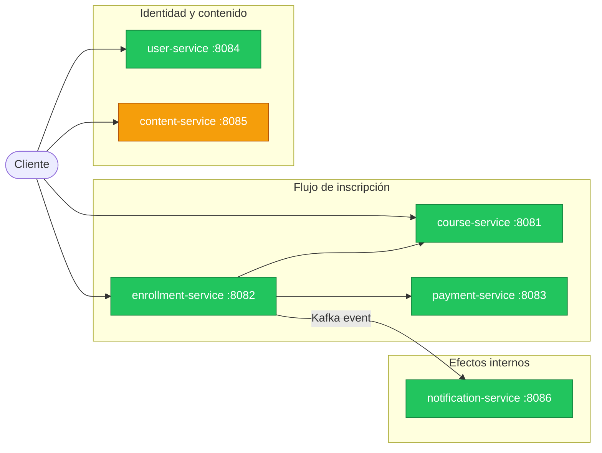
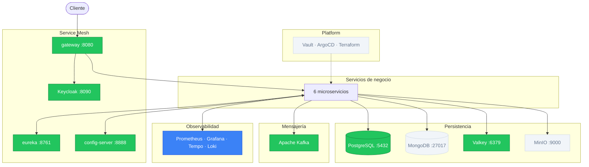

# v6 — Observability

## Estado del sistema

### Servicios de negocio



<table>
  <tr>
    <td style="background:#3b82f6;color:#fff;padding:2px 8px;border-radius:4px;"><strong>Azul</strong></td>
    <td>Nuevo en esta versión</td>
    <td style="background:#f59e0b;color:#fff;padding:2px 8px;border-radius:4px;"><strong>Amarillo</strong></td>
    <td>Desarrollando</td>
    <td style="background:#22c55e;color:#fff;padding:2px 8px;border-radius:4px;"><strong>Verde</strong></td>
    <td>Terminado</td>
    <td style="background:#f1f5f9;color:#64748b;padding:2px 8px;border-radius:4px;"><strong>Gris</strong></td>
    <td>Sin cambios / no aplica</td>
  </tr>
</table>

### Infraestructura



<table>
  <tr>
    <td style="background:#3b82f6;color:#fff;padding:2px 8px;border-radius:4px;"><strong>Azul</strong></td>
    <td>Nuevo en esta versión</td>
    <td style="background:#f59e0b;color:#fff;padding:2px 8px;border-radius:4px;"><strong>Amarillo</strong></td>
    <td>Desarrollando</td>
    <td style="background:#22c55e;color:#fff;padding:2px 8px;border-radius:4px;"><strong>Verde</strong></td>
    <td>Terminado</td>
    <td style="background:#f1f5f9;color:#64748b;padding:2px 8px;border-radius:4px;"><strong>Gris</strong></td>
    <td>Sin cambios / no aplica</td>
  </tr>
</table>

---

## Por qué esta versión

Con siete servicios en producción, cuando `POST /enrollments` tarda 3 segundos, es imposible saber en cuál de los servicios está el cuello de botella. Sin métricas, no se sabe qué porcentaje de los pagos está fallando ni cuál es la latencia p99 de cada endpoint. Los logs de cada servicio son independientes — correlacionar un error a través de varios saltos es un proceso manual propenso a errores.

v6 implementa los tres pilares de observabilidad: trazas distribuidas (OpenTelemetry + Tempo), métricas (Micrometer + Prometheus + Grafana), y logs estructurados (Logback JSON + Loki). Un único `traceId` atraviesa todos los servicios y el Gateway.

## Qué se construye

| Componente | Estado | Descripción |
|---|---|---|
| Prometheus + Grafana + Tempo + Loki | Nuevo | Stack completo: métricas, trazas distribuidas y logs estructurados |
| `content-service` | Desarrollando | Recibe instrumentación de observabilidad |
| Los otros 6 servicios de negocio | Terminado | Instrumentación completa con OpenTelemetry y JSON logs |

---

## Diseño

### Los tres pilares de la observabilidad

| Pilar | Pregunta que responde | Herramienta |
|---|---|---|
| **Métricas** | ¿Cuántos requests por segundo? ¿Cuánto tarda el p99? | Micrometer + Prometheus |
| **Trazas** | ¿Qué camino siguió este request específico? | OpenTelemetry + Grafana Tempo |
| **Logs** | ¿Qué pasó exactamente en este servicio? | Logback JSON + Grafana Loki |

Los tres se correlacionan por `traceId`: un UUID que se genera al entrar al Gateway
y se propaga a todos los servicios involucrados en ese request.

---

### 1. Trazas distribuidas — OpenTelemetry + Tempo

OpenTelemetry es el estándar de la industria para instrumentación.
Spring Boot 3+ lo integra con `spring-boot-starter-actuator` + `micrometer-tracing`.

Cada llamada HTTP y cada operación de base de datos genera un **span**.
Un conjunto de spans relacionados forma una **traza** con un `traceId` compartido.

```
GET /enrollments/abc123 (traceId: 4f2a...)
  ├── Gateway → enrollment-service (spanId: 1)
  ├── enrollment-service → GET /courses/xyz (spanId: 2)
  │     └── course-service: DB query SELECT * FROM courses (spanId: 3)
  └── enrollment-service: DB query SELECT * FROM enrollments (spanId: 4)
```

En Grafana Tempo puedes visualizar ese árbol de spans y ver exactamente
en qué span se gastaron los 800ms que tardó el request.

### 2. Métricas — Micrometer + Prometheus

Micrometer (incluido en Spring Boot Actuator) expone métricas en formato Prometheus
en `/actuator/prometheus`.

Prometheus hace scraping periódico de ese endpoint y almacena las series de tiempo.

Métricas clave que se instrumentan:

| Métrica | Tipo | Descripción |
|---|---|---|
| `http_server_requests_seconds` | Histogram | Latencia por endpoint, método y status code |
| `http_server_requests_active` | Gauge | Requests en vuelo en este momento |
| `jvm_memory_used_bytes` | Gauge | Uso de memoria heap/non-heap |
| `resilience4j_circuitbreaker_state` | Gauge | Estado del circuit breaker (0=closed, 1=open, 2=half-open) |
| `kafka_consumer_lag` | Gauge | Cuántos mensajes hay pendientes de procesar |

### 3. Logs estructurados — Logback JSON + Loki

Los logs pasan de formato texto plano a JSON:

```json
// antes (texto plano — difícil de filtrar)
2024-01-15 10:23:45 INFO  CourseService - Course not found: abc123

// después (JSON — filtrable por campo)
{
  "timestamp": "2024-01-15T10:23:45.123Z",
  "level": "WARN",
  "service": "course-service",
  "traceId": "4f2a8b3c",
  "spanId": "7e1d4f2a",
  "message": "Course not found",
  "courseId": "abc123"
}
```

Grafana Loki indexa solo los metadatos (service, level, traceId) y guarda el contenido
raw comprimido. Es mucho más eficiente que Elasticsearch para logs de alta frecuencia.

### 4. Grafana como panel unificado

Un solo dashboard en Grafana permite:

1. Ver la tasa de errores en las últimas 6 horas (métricas de Prometheus)
2. Hacer clic en el pico de errores de las 14:32 → ver los requests fallidos
3. Hacer clic en un request → ver la traza completa en Tempo
4. Hacer clic en un span → ver los logs de ese servicio en ese momento en Loki

Esto es la correlación de señales: navegar desde síntoma → causa en segundos.

---

## Stack de observabilidad en Docker Compose

```yaml
services:
  prometheus:
    image: prom/prometheus:latest
    # scrape config apunta a /actuator/prometheus de cada servicio

  tempo:
    image: grafana/tempo:latest
    # recibe trazas via OTLP (puerto 4317)

  loki:
    image: grafana/loki:latest
    # recibe logs via Promtail o driver de Loki

  grafana:
    image: grafana/grafana:latest
    # data sources: Prometheus, Tempo, Loki
    # dashboards precargados via provisioning
```

---

## Limitaciones intencionales

| Limitación | Impacto | Se aborda en |
|---|---|---|
| Logs en Docker local, no persistentes | Se pierden al reiniciar los contenedores | v7 (volúmenes) / v8 (cloud logging) |
| Sin alertas configuradas | Degradación no detectada hasta revisión manual | v8 (Grafana Alerting → PagerDuty/Slack) |

---

## Conceptos de estudio

**RED Method**
La métrica mínima para cualquier servicio: Rate (requests/segundo), Errors (% de errores),
Duration (latencia). Con solo estos tres números sabes si un servicio tiene problemas.

**USE Method** (para infraestructura)
Utilization, Saturation, Errors. Se aplica a recursos: CPU, memoria, I/O, threads.
Complementa RED: RED dice "hay un problema", USE dice "el problema es que la CPU está al 95%".

**Sampling en trazas**
Registrar el 100% de las trazas en un sistema de alto tráfico es costoso.
Head-based sampling decide al entrar si esta traza se registra (no tienes info del error aún).
Tail-based sampling decide al salir — si la traza tuvo error, siempre se guarda.
En el lab usamos head-based al 100% (tráfico bajo). En producción, típicamente 1-10%.

**Por qué el traceId en los logs cambia todo**
Sin traceId, correlacionar logs de 3 servicios para un request específico requiere
comparar timestamps y adivinar. Con traceId, es una query: `{traceId="4f2a8b3c"}`.


