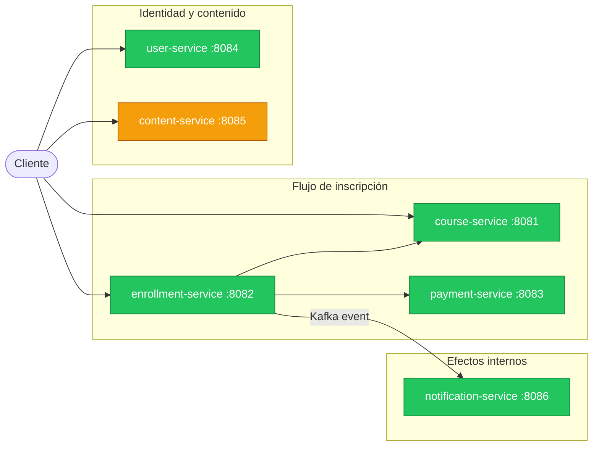
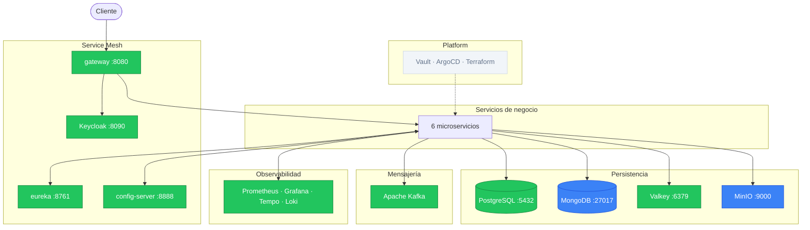

# v7 — Deployment

## Estado del sistema

### Servicios de negocio



<table>
  <tr>
    <td style="background:#3b82f6;color:#fff;padding:2px 8px;border-radius:4px;"><strong>Azul</strong></td>
    <td>Nuevo en esta versión</td>
    <td style="background:#f59e0b;color:#fff;padding:2px 8px;border-radius:4px;"><strong>Amarillo</strong></td>
    <td>Desarrollando</td>
    <td style="background:#22c55e;color:#fff;padding:2px 8px;border-radius:4px;"><strong>Verde</strong></td>
    <td>Terminado</td>
    <td style="background:#f1f5f9;color:#64748b;padding:2px 8px;border-radius:4px;"><strong>Gris</strong></td>
    <td>Sin cambios / no aplica</td>
  </tr>
</table>

### Infraestructura



<table>
  <tr>
    <td style="background:#3b82f6;color:#fff;padding:2px 8px;border-radius:4px;"><strong>Azul</strong></td>
    <td>Nuevo en esta versión</td>
    <td style="background:#f59e0b;color:#fff;padding:2px 8px;border-radius:4px;"><strong>Amarillo</strong></td>
    <td>Desarrollando</td>
    <td style="background:#22c55e;color:#fff;padding:2px 8px;border-radius:4px;"><strong>Verde</strong></td>
    <td>Terminado</td>
    <td style="background:#f1f5f9;color:#64748b;padding:2px 8px;border-radius:4px;"><strong>Gris</strong></td>
    <td>Sin cambios / no aplica</td>
  </tr>
</table>

---

## Por qué esta versión

Hasta v6 el sistema solo corre en local. "Funciona en mi máquina" es una garantía inválida: sin contenedores, los entornos divergen en versiones de Java, bibliotecas y configuración. El deploy es un proceso manual, sin documentar y sin automatizar. Un pod caído no se recupera solo. `content-service` aún no tiene implementación real.

v7 contiene todo: Dockerfiles multi-stage por servicio, Kubernetes declarativo con self-healing, GitHub Actions para CI/CD, y la implementación completa de `content-service` con MongoDB y MinIO.

## Qué se construye

| Componente | Estado | Descripción |
|---|---|---|
| Dockerfile multi-stage (×7 servicios) | Nuevo | Imagen de runtime sin JDK ni Maven; ~200 MB en lugar de ~600 MB |
| Manifests Kubernetes (`k8s/`) | Nuevo | Deployment, Service, ConfigMap, Secret por servicio; namespace `paideia` |
| GitHub Actions pipeline | Nuevo | Build → test → push imagen → actualizar tag K8s |
| MinIO | Nuevo | Almacenamiento de archivos para `content-service` (S3-compatible) |
| `content-service` | Desarrollando | Implementación completa: metadata en MongoDB y binarios en MinIO |

---

## Diseño

### 1. Dockerfile multi-stage por servicio

Cada servicio de negocio obtiene su propio Dockerfile con build en dos etapas:

```dockerfile
# Etapa 1: build (imagen con JDK completo + Maven)
FROM eclipse-temurin:21-jdk AS builder
WORKDIR /build
COPY . .
RUN ./mvnw package -pl services/course-service -am -DskipTests

# Etapa 2: runtime (imagen mínima sin JDK ni Maven)
FROM eclipse-temurin:21-jre
WORKDIR /app
COPY --from=builder /build/services/course-service/target/*.jar app.jar
ENTRYPOINT ["java", "-jar", "app.jar"]
```

La imagen de runtime no contiene el JDK, Maven, el código fuente, ni las dependencias de build.
Resultado típico: imagen de ~200MB en lugar de ~600MB, y menor superficie de ataque.

### 2. Docker Compose completo

El `docker-compose.yml` de v7 levanta todo el sistema: servicios de negocio, infraestructura
(Postgres, Kafka, Eureka, Config Server, Gateway), y observabilidad (Prometheus, Tempo, Loki, Grafana).

```bash
docker compose up -d  # levanta ~12 servicios
```

Las imágenes de los servicios de negocio se construyen localmente con `build: ./services/course-service`.

### 3. Kubernetes

Se agregan manifests de Kubernetes en `k8s/` que permiten desplegar el sistema en un clúster real
(o local con `kind` o `minikube`).

```
k8s/
  namespace.yaml
  course-service/
    deployment.yaml
    service.yaml
    configmap.yaml
  enrollment-service/
    ...
  payment-service/
    ...
  infra/
    postgres/
    kafka/
    eureka/
```

**Por qué Kubernetes** (ver sección más abajo para detalle).

Recursos K8s que se usan en este lab:

| Recurso | Para qué sirve |
|---|---|
| `Deployment` | Declara cuántas réplicas del servicio deben estar corriendo; los gestiona K8s |
| `Service` | DNS interno fijo para llegar al pod; load balancing entre réplicas |
| `ConfigMap` | Variables de configuración no sensibles (URLs, nombres, flags) |
| `Secret` | Credenciales y datos sensibles (contraseñas, tokens) — base64 encoded |
| `Namespace` | Aislamiento lógico dentro del clúster (todos los recursos del lab en `paideia`) |

### 4. GitHub Actions — CI/CD

Pipeline automatizado que se activa con cada push:

```yaml
on:
  push:
    paths:
      - 'services/course-service/**'   # solo cuando cambia este servicio

jobs:
  build-and-push:
    steps:
      - Checkout
      - Setup JDK 21
      - Build con Maven (solo el módulo cambiado)
      - Ejecutar tests
      - Build imagen Docker
      - Push a GitHub Container Registry (ghcr.io)
      - Actualizar el tag de imagen en k8s/course-service/deployment.yaml
      - Commit del cambio (ArgoCD lo detectará en v8)
```

El filtro `paths` evita reconstruir todos los servicios cuando solo cambia uno.

---

### Kubernetes en detalle

Kubernetes es un orquestador de contenedores. Su trabajo es responder a una pregunta:
"quiero que haya 3 réplicas de `course-service` corriendo en todo momento" — y mantener
eso verdadero sin importar lo que pase.

**Problema que resuelve**

Con solo Docker, si el proceso del servicio cae, se queda caído hasta que alguien lo reinicie.
Con `docker compose`, tampoco hay health check real ni reinicio automático sofisticado.
Con Kubernetes:

```
Pod de course-service cae
  → K8s detecta que hay 0 réplicas en lugar de 3
  → K8s crea un nuevo pod automáticamente (self-healing)
  → El Service (DNS interno) ya apunta a los pods sanos
  → Los clients no notan nada
```

**Componentes clave que usa el lab**

```
┌─────────────────────────────────────────────────────┐
│                      Cluster K8s                    │
│                                                     │
│  ┌─────────────────────────────────────────────┐   │
│  │              Namespace: paideia              │   │
│  │                                             │   │
│  │  Service: course-service (ClusterIP)        │   │
│  │    → Pod: course-service (réplica 1)        │   │
│  │    → Pod: course-service (réplica 2)        │   │
│  │                                             │   │
│  │  ConfigMap: course-service-config           │   │
│  │    DB_URL=jdbc:postgresql://postgres:5432/… │   │
│  │                                             │   │
│  │  Secret: course-service-secrets             │   │
│  │    DB_PASSWORD=<base64>                     │   │
│  └─────────────────────────────────────────────┘   │
└─────────────────────────────────────────────────────┘
```

**Deployment vs Pod**

No se crean Pods directamente. Se crea un `Deployment` que declara el estado deseado.
K8s crea y gestiona los Pods para cumplir ese estado.

```yaml
apiVersion: apps/v1
kind: Deployment
metadata:
  name: course-service
spec:
  replicas: 2                    # quiero 2 instancias
  selector:
    matchLabels:
      app: course-service
  template:
    spec:
      containers:
        - name: course-service
          image: ghcr.io/usuario/course-service:v7.0.0
          envFrom:
            - configMapRef:
                name: course-service-config
            - secretRef:
                name: course-service-secrets
```

**Service (el DNS interno)**

Un `Service` de tipo `ClusterIP` es simplemente un nombre DNS estable dentro del clúster.
`course-service` siempre resuelve a los pods sanos de ese Deployment, sin importar
cuántas réplicas hay o si alguna se reinició.

Esto es equivalente a lo que hace Eureka en v2-v6, pero a nivel de plataforma.
En un clúster K8s real, normalmente no necesitas Eureka porque K8s ya provee el DNS.

---

### Correr el lab en local con kind

```bash
# instalar kind (Kubernetes IN Docker)
# https://kind.sigs.k8s.io/

kind create cluster --name paideia

# aplicar todos los manifests
kubectl apply -f k8s/

# ver el estado
kubectl get pods -n paideia

# acceder al gateway (port-forward porque no hay LoadBalancer en local)
kubectl port-forward svc/gateway-service 8080:8080 -n paideia
```

---

### 5. content-service (MongoDB + MinIO)

El problema con v1-v6: los archivos de contenido (videos, PDFs, materiales de curso)
no tienen un lugar correcto donde vivir. Guardarlos en SQL como `BYTEA` funciona para
archivos pequeños pero es desastroso a escala.

`content-service` resuelve eso usando **object storage** (MinIO como S3-compatible local).

### Responsabilidades

| Endpoint | Descripción |
|---|---|
| `POST /contents` | Recibe `multipart/form-data`, sube un archivo y lo almacena en MinIO |
| `GET /contents?courseId={courseId}` | Lista archivos de un curso comprado por el estudiante autenticado |
| `GET /contents/{fileId}/download-url` | Genera URL pre-firmada solo si el estudiante tiene acceso |

### Object storage: el patrón correcto

```
Upload:
  Cliente → POST /contents → content-service
                          → sube a MinIO → recibe storageKey
                          → persiste (courseId, fileId, storageKey, filename, size, metadata) en DB

Download (patrón pre-signed URL):
  Cliente → GET /contents/{fileId}/download-url → content-service
                                          → genera URL pre-firmada (válida 15 min)
                                          → retorna URL
  Cliente → GET <URL pre-firmada> → MinIO (directo, sin pasar por el servicio)
```

La URL pre-firmada es la clave: el cliente descarga directamente desde MinIO,
sin que el archivo pase por `content-service`. Esto evita que el servicio sea
un cuello de botella de ancho de banda.

### Base de datos `paideia_content`

```
contents
  id          UUID PK
  course_id   UUID NOT NULL  (referencia lógica — no FK cross-service)
  storage_key VARCHAR(500) NOT NULL  (path en MinIO: courses/{courseId}/{fileId})
  filename    VARCHAR(255) NOT NULL
  content_type VARCHAR(100) NOT NULL
  size_bytes  BIGINT NOT NULL
  metadata    JSONB
  uploaded_at TIMESTAMPTZ
```

### Por qué MinIO y no SQL

| Criterio | SQL (PostgreSQL) | Object Storage (MinIO / S3) |
|---|---|---|
| Archivos grandes (>10MB) | Malo — bloquea el pool de conexiones | Correcto |
| Streaming | No nativo | Nativo (multipart) |
| CDN / pre-signed URLs | No soportado | Nativo |
| Costo a escala | Muy alto | Bajo |
| Backup / versionado | Posible pero costoso | Nativo (versioning de objetos) |

---

## Limitaciones intencionales

| Limitación | Impacto | Se aborda en |
|---|---|---|
| K8s Secrets son solo base64 (no cifrado real) | Cualquiera con acceso a etcd puede leer credenciales | v8 (Vault) |
| Infraestructura del clúster creada manualmente (`kind`) | No reproducible; estado real no documentado en código | v8 (Terraform) |
| Deploy manual (`kubectl apply`) | Sin trazabilidad de quién desplegó qué y cuándo | v8 (ArgoCD) |

---

## Conceptos de estudio

**Immutable infrastructure**
Una vez que una imagen de contenedor está construida y taggeada, no se modifica.
Si hay que cambiar algo, se construye una nueva imagen con nuevo tag y se reemplaza el pod.
Nunca `docker exec` + editar archivos dentro de un contenedor en producción.

**Declarative vs imperative**
Con `kubectl run ...` (imperativo) le dices a K8s qué hacer.
Con `kubectl apply -f deployment.yaml` (declarativo) le dices qué estado quieres.
K8s averigua cómo llegar a ese estado. Si el archivo no cambia, un segundo `apply` no hace nada.

**12-factor app: factor XI — Logs**
Los contenedores no escriben logs a archivos. Escriben a stdout/stderr.
K8s captura esos streams. Loki los recoge desde ahí.
El contenedor no sabe ni le importa dónde terminan sus logs.

---

## Alternativas sugeridas

| Branch | Base | Qué explora |
|---|---|---|
| `alt/service-mesh` | `v7.0.0` | Istio para mTLS, traffic policies y observabilidad de red |
| `alt/keycloak-full` | `v7.0.0` | Keycloak en Kubernetes con toda la infraestructura |
| `alt/rabbitmq-keycloak` | `v7.0.0` | Sistema completo con RabbitMQ + Keycloak desplegados |
| `alt/platform-local` | `v7.0.0` | Todo en local con kind + providers locales de Terraform |


