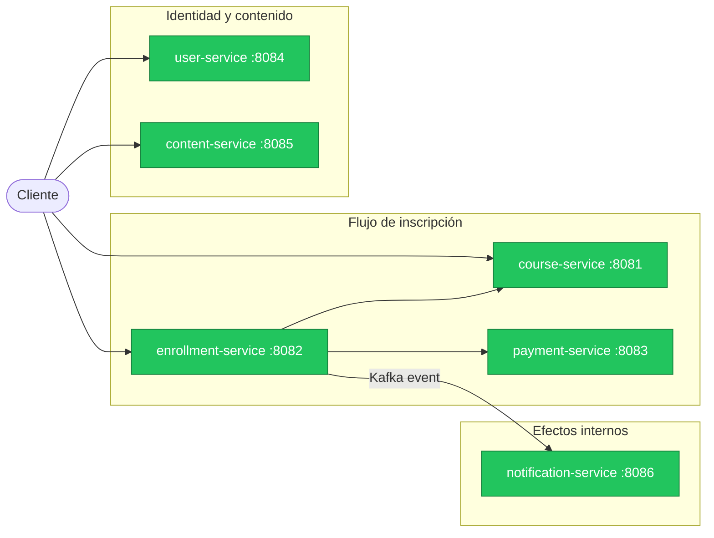
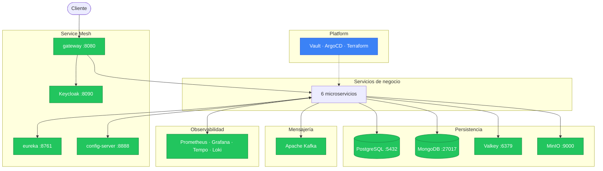

# v8 — Platform

## Estado del sistema

### Servicios de negocio



<table>
  <tr>
    <td style="background:#3b82f6;color:#fff;padding:2px 8px;border-radius:4px;"><strong>Azul</strong></td>
    <td>Nuevo en esta versión</td>
    <td style="background:#f59e0b;color:#fff;padding:2px 8px;border-radius:4px;"><strong>Amarillo</strong></td>
    <td>Desarrollando</td>
    <td style="background:#22c55e;color:#fff;padding:2px 8px;border-radius:4px;"><strong>Verde</strong></td>
    <td>Terminado</td>
    <td style="background:#f1f5f9;color:#64748b;padding:2px 8px;border-radius:4px;"><strong>Gris</strong></td>
    <td>Sin cambios / no aplica</td>
  </tr>
</table>

### Infraestructura



<table>
  <tr>
    <td style="background:#3b82f6;color:#fff;padding:2px 8px;border-radius:4px;"><strong>Azul</strong></td>
    <td>Nuevo en esta versión</td>
    <td style="background:#f59e0b;color:#fff;padding:2px 8px;border-radius:4px;"><strong>Amarillo</strong></td>
    <td>Desarrollando</td>
    <td style="background:#22c55e;color:#fff;padding:2px 8px;border-radius:4px;"><strong>Verde</strong></td>
    <td>Terminado</td>
    <td style="background:#f1f5f9;color:#64748b;padding:2px 8px;border-radius:4px;"><strong>Gris</strong></td>
    <td>Sin cambios / no aplica</td>
  </tr>
</table>

---

## Por qué esta versión

Los K8s Secrets son base64, no cifrados — almacenarlos en Git es equivalente a texto plano. La infraestructura cloud fue creada manualmente: no es reproducible, no está documentada y su estado real no coincide con lo que está escrito en algún lugar. El despliegue depende de `kubectl apply` manual sin trazabilidad de quién desplegó qué y cuándo.

v8 lleva el sistema a un entorno cloud real con tres pilares: Vault para secrets cifrados y dinámicos, Terraform para infraestructura como código, y ArgoCD para GitOps — el estado del clúster es exactamente lo que está en Git.

## Qué se construye

| Componente | Estado | Descripción |
|---|---|---|
| HashiCorp Vault | Nuevo | Secretos cifrados y dinámicos; reemplaza K8s Secrets para credenciales de DB |
| ArgoCD | Nuevo | GitOps: el clúster K8s siempre refleja el estado de Git |
| Terraform | Nuevo | Infraestructura como código para clúster cloud (EKS/AKS/GKE) |
| Clúster gestionado (EKS/AKS/GKE) | Nuevo | Reemplaza `kind`; el cloud provider gestiona el control plane |

---

## Diseño

### 1. HashiCorp Vault — Gestión de secretos

Los `Secret` de Kubernetes son solo base64. Cualquiera con acceso de lectura al clúster
puede decodificarlos. Vault reemplaza ese mecanismo con secretos dinámicos y rotación automática.

**Secretos estáticos vs dinámicos:**

| | K8s Secret (v7) | Vault (v8) |
|---|---|---|
| Almacenamiento | etcd del clúster (base64) | Vault (cifrado AES-256) |
| Rotación | Manual | Automática (Vault crea credenciales con TTL) |
| Auditoría | No | Sí — log de quién accedió a qué y cuándo |
| Credenciales DB | Fijas en el manifest | Vault genera usuario+password únicos por pod, con TTL |

**Vault Agent Injector** inyecta secretos en los pods como archivos o variables de entorno
sin que el código de la app cambie:

```yaml
# annotations en el Deployment
vault.hashicorp.com/agent-inject: "true"
vault.hashicorp.com/agent-inject-secret-db: "database/creds/course-service"
```

El pod arranca con sus credenciales de DB inyectadas automáticamente.
Cuando expiran, Vault Agent las renueva sin reiniciar el pod.

### 2. Terraform — Infraestructura como código

En lugar de crear el clúster K8s y los recursos cloud manualmente desde la consola,
Terraform los declara en archivos `.tf` y los crea/destruye de forma reproducible.

```hcl
# infra/main.tf

resource "aws_eks_cluster" "paideia" {
  name    = "paideia-lab"
  version = "1.29"
  ...
}

resource "aws_rds_instance" "postgres" {
  engine         = "postgres"
  engine_version = "16"
  instance_class = "db.t3.micro"
  ...
}
```

```bash
terraform init      # descarga providers (AWS/Azure/GCP)
terraform plan      # muestra qué va a crear/modificar/destruir
terraform apply     # crea la infraestructura
terraform destroy   # destruye todo (importante para no generar costos)
```

El estado de la infraestructura se almacena en un **backend remoto** (S3, Azure Blob, GCS)
para que el equipo lo comparta y no dependa de la máquina local de nadie.

### 3. ArgoCD — GitOps

En v7 el deploy es manual: `kubectl apply -f k8s/`.
ArgoCD automatiza ese paso y hace que Git sea la fuente de verdad:

```
GitHub Actions construye imagen → push a ghcr.io:v8.0.1
GitHub Actions actualiza k8s/course-service/deployment.yaml con el nuevo tag
ArgoCD detecta el cambio en el repositorio Git
ArgoCD aplica el cambio al clúster automáticamente
```

Si alguien hace `kubectl apply` manual con un manifiesto diferente,
ArgoCD lo detecta como "out of sync" y puede revertirlo al estado del repositorio.

El repositorio Git es siempre la fuente de verdad del estado del clúster.

**ArgoCD UI:** panel visual que muestra el estado de cada aplicación, si está sincronizada,
el historial de deploys, y permite hacer rollback con un clic.

### 4. Clúster cloud gestionado

`kind` de v7 se reemplaza por un clúster Kubernetes gestionado por el cloud provider:

| Cloud | Servicio | Notas |
|---|---|---|
| AWS | EKS (Elastic Kubernetes Service) | Más usado en industria |
| Azure | AKS (Azure Kubernetes Service) | Azure for Students da crédito gratis |
| GCP | GKE (Google Kubernetes Engine) | Free tier para clúster autopilot pequeño |

El proveedor gestiona el control plane (API server, etcd, scheduler).
El equipo solo gestiona los nodos workers y los workloads.

---

### Infraestructura que provee Terraform en este lab

```
infra/
  providers.tf        # configuración del provider (AWS o Azure)
  variables.tf        # región, tamaño de nodos, nombre del clúster
  main.tf
    ├── VPC / Virtual Network
    ├── Clúster K8s (EKS/AKS/GKE)
    ├── Node group (2 nodos t3.small o equivalent)
    ├── PostgreSQL gestionado (RDS/Azure DB/Cloud SQL)
    ├── MSK / Event Hubs / Pub Sub (Kafka gestionado)
    └── Container Registry (ECR/ACR/GCR)
  outputs.tf          # kubeconfig, endpoints de las bases de datos
```

---

### Coste estimado y alternativas sin coste

**Coste en cloud con Free Tier (estimado para el lab):**

| Recurso | AWS Free Tier / mes | Azure for Students |
|---|---|---|
| EKS/AKS control plane | $0.10/hora (~$73/mes)  | Gratis con crédito |
| 2x t3.small nodos | ~$30/mes | Gratis con crédito |
| RDS postgres t3.micro | Gratis 12 meses | Gratis con crédito |
| **Total** | **~$100/mes si no hay Free Tier para EKS** | **Gratis con crédito estudiantil** |

> El mayor costo es el control plane de EKS. AKS y GKE Autopilot son más baratos o gratis para clústeres pequeños.

**Alternativa sin costo cloud (practicar los conceptos sin gastar):**

| Componente | Alternativa local |
|---|---|
| EKS/AKS/GKE | `kind` (ya disponible desde v7) |
| Vault | Vault en Docker dentro del clúster `kind` |
| ArgoCD | ArgoCD en el clúster `kind` |
| Terraform | Terraform con provider `kind` o `local` |
| Registry | `ghcr.io` (GitHub gratis) o registry local |

Con esta config se aprenden todos los conceptos sin costo.
La diferencia con cloud real es solo que no hay managed services ni alta disponibilidad real.

```bash
# setup local completo
kind create cluster --name paideia-v8
kubectl apply -f https://raw.githubusercontent.com/argoproj/argo-cd/stable/manifests/install.yaml -n argocd
helm install vault hashicorp/vault --set "server.dev.enabled=true"
```

---

## Limitaciones intencionales

| Limitación | Notas |
|---|---|
| Keycloak sin alta disponibilidad | Standalone en un único pod; en producción requeriría réplicas o un IdP gestionado |
| Kafka sin replicación real | Configurado con `replication.factor=1`; en producción mínimo 3 brokers |
| Sin horizontal autoscaling | HPA requiere métricas de CPU/memoria; en el lab las réplicas son estáticas |

---

## Conceptos de estudio

**Infrastructure as Code (IaC)**
El estado de la infraestructura se declara en código versionado en Git.
Si alguien borra el clúster por accidente, se recrea con `terraform apply`.
No hay "conocimiento tribal" de cómo se creó manualmente.

**GitOps vs CI/CD clásico**
En CI/CD clásico: el pipeline hace `kubectl apply` directamente.
En GitOps: el pipeline actualiza el repositorio; ArgoCD aplica el estado del repositorio al clúster.
Diferencia clave: el estado deseado del clúster siempre es auditable en Git (quién cambió qué y cuándo).

**Vault dynamic secrets**
Vault puede generar credenciales de base de datos al vuelo con TTL.
El pod recibe usuario `v-course-svc-abc123` con contraseña única, válida por 1 hora.
Cuando expira, Vault las renueva. La contraseña de producción nunca aparece en Git ni en archivos de config.

**Shared responsibility model**
Con EKS/AKS/GKE, el cloud provider es responsable del control plane K8s (disponibilidad, parches).
El equipo es responsable de los workloads, la configuración de red, los secretos, y los nodos workers.
Con VMs propias (v7 con `kind`), el equipo es responsable de todo.

**State backend de Terraform**
`terraform.tfstate` registra qué recursos existen en la nube.
Si vive en local y la máquina del dev se pierde, no hay forma de saber qué destruir.
El state backend remoto (S3, Azure Blob) lo almacena de forma compartida y con lock para evitar
que dos ejecuciones concurrentes corrompan el estado.

---

## Alternativas sugeridas

**`alt/platform-local` — Todo en local sin costo**

Mismo stack de v8 (Vault, ArgoCD, Terraform) pero usando `kind` como clúster
y providers locales de Terraform. Permite estudiar todos los conceptos sin cuenta cloud.
Base: `v7.0.0`.


